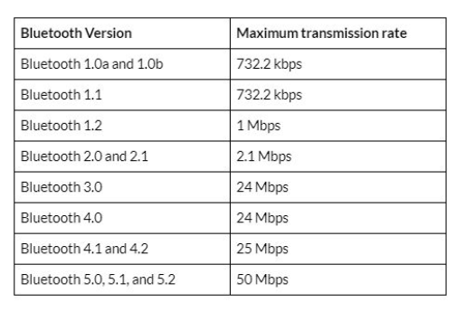

### Max Transmittion Rate

### BR/EDR, Bluetooth Low Energy 和 Bluetooth5的对比

* BR: 技术在Bluetooth1.0中被提出，首次规范了蓝牙无线传输的协议，速率达到0.7Mbps。使用2.4GHz范围的带宽，分为79个Channel，每个Channel占用1MHz
* EDR: 技术在Bluetooth2.0中被提出，提升速率到2.1Mbps。
* BLE: BLE首先由Wibree提出，后被Bluetooth SIG并入Specification中。使用2.4GHz带宽，分为40个Channel，每个Channel占用2MHz。BLE技术节省了电量消耗，但是传输范围较短。BLE和BR/EDR的物理层存在差异，互相之间不能兼容。
* Bluetooth5：提出了三种物理层实现。前两种物理层通过冗余数据位的方式增加数据传输范围，第三种物理层通过加倍数据传输率的方式增加吞吐量。

