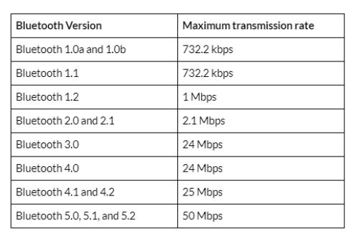

# Communication

对于蓝牙/网络设备的通信，大都需要经过以下几个步骤：
1. 选择通信的设备
2. 选择通信协议
3. 设定端口号，通过Discovery协议发现设备
4. 建立连接并传输数据

### 1. 选择通信设备
* 每个设备都有48-bit地址，用于标识Bluetooth设备，类似于MAC地址。
* Bluetooth通过广播方式识别邻近的设备。

### 2. 选择通信协议
1. **RFCOMM**: RFCOMM提供类似于TCP的可靠传输机制，同时有类似于时间窗口的机制。但是在一台机器上，RFCOMM最多只能开放30个ports。
   
2. **L2CAP**: 默认地，L2CAP提供面向连接的可靠传输协议，发送固定长度的数据包。类似于UDP，其发送固定长度的数据包。

L2CAP通过确认/重传的机制达到可靠传输的效果。

另外，L2CAP可以配置未确认数据包重发策略达到最佳的网络利用率。对于未确认的数据包，可以配置的策略包括：
    * 从不重传
    * 在所有连接失败时重传
    * 在时间阈值(0-1279ms)后丢弃队列数据包，不再重传。

每个设备在设定传输协议后，最好不要再改变，每次改变都会影响当前设备的所有连接。
Bluetooth的传输协议可以和TCP/UDP一一对应，可以针对需求，选择不同的传输协议：

| Requirement | Internet | Bluetooth |
| --- | --- | --- |
| Reliable, streams-based | TCP | RFCOMM |
| Reliable, datagram | TCP | RFCOMM or L2CAP with infinite retransmit |
| Best-effort, datagram | UDP | L2CAP(0-1279ms retransmit) |

### 3. 设定端口号，通过Discovery协议发现设备

在网络应用中，TCP/UDP应用程序通过使用固定的端口号进行通信，例如http服务使用80端口。然而在Bluetooth中，端口号通常较少，不足以每个应用使用固定的端口号，所以Bluetooth使用动态的端口号进行通信。

下表显示了协议对应的端口号：
| protocol | terminology | reserved | dynamic assigned ports |
| --- | --- | --- | --- |
| TCP | port | 1-1024 | 1025-65535 |
| UDP | port | 1-1024 | 1025-65535 |
| RFCOMM | channel | none | 1-30 |
| L2CAP | PSM | odd number 1-4095 | odd number 4097-32765 |

在Bluetooth应用中，host machine运行server应用(SDK server)，使用L2CAP保留的端口号提供服务，其他server应用通过SDP server动态申请端口号，并将提供的服务描述符UUID注册到SDP server中。Client应用与SDP server通信，查询需要的服务UUID，获取SDP server中注册的服务。

UUID(Universary Unique Identifier)是一个128-bit的数字。

### 4. 建立连接，传输数据

