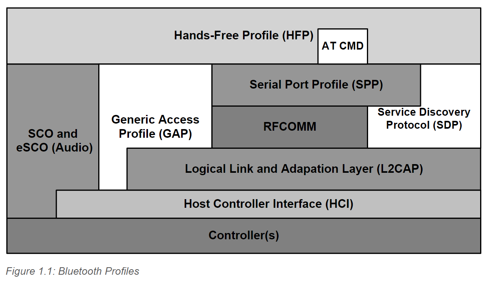
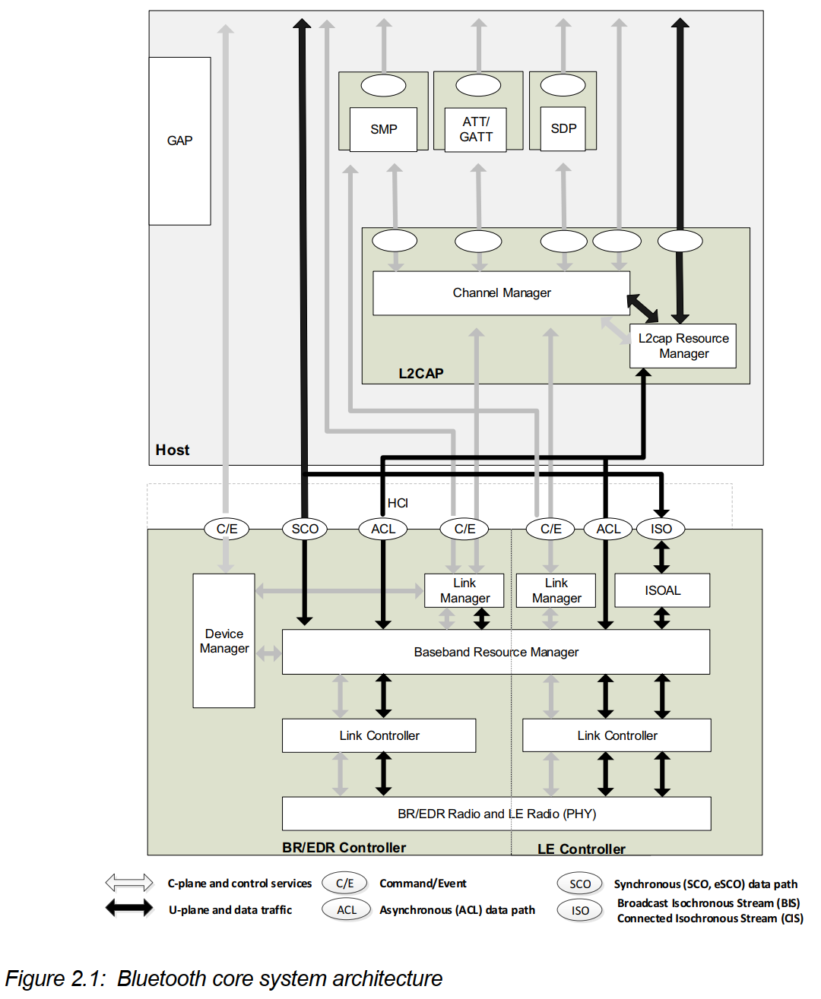

### Bluetooth Profiles

蓝牙系统中包含多种core configuration(我的理解是类似于functionality)，不同类型的产品包含覆盖不同的Core Configuration，进而构成功能不同、类型分级的产品。

## Core Architecture Blocks

### Host Architecture

#### 1. Channel manager

主要负责与remote device建立连接L2CAP(Logical Link Control and Adaptation protocol) channel，从而传输service protocol和数据流。Channel manager与本地的Link manager进行交互，从而创建logical links。

#### 2. L2CAP resource manager

L2CAP资源管理器负责管理报文(PDU fragments)，保证传输的可靠性。防止link controller因为buffer太小，导致PDU传输丢包等问题。

#### 3. Security Manager Protocol

SMP是一个点对点的协议，负责生成、管理加密密钥和ID密钥。在BR/EDR系统中，SMP的工作由Controller层的Link Manager负责；在LE系统中，SMP的工作由Host层的SMP负责，主要目的是为了减少LE实现的开销。

#### 4. Attribute Protocol

ATT协议是一个点对点的协议，实现了ATT Client和ATT Server通信的功能。ATT Client和ATT Server在专用的固定L2CAP channel中通信。ATT Client发送命令、请求和确认消息；ATT Server发送响应，通知和指示消息。

#### 5. Generic Attribute Profile (GATT)

GATT代表ATT Server及ATT Client的功能，描述了服务的层级、以及Characteristics和Attributes。GATT提供了发现、读、写、以及指示这些功能的Characteristics和Attributes的接口。
GATT用于LE设备的LE服务发现功能。

#### 6. Generic Access Profile (GAP)

GAP定义了蓝牙设备的基本功能，包括传输层、协议、应用配置的模式和访问例程。
GAP服务包括设备发现、连接模式、安全、认证、关联模式和服务发现。

### BR/EDR/LE Controller Architecture

