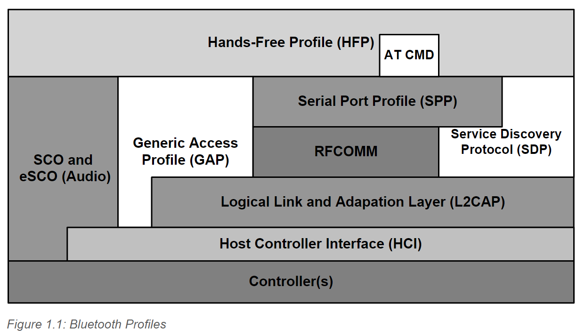
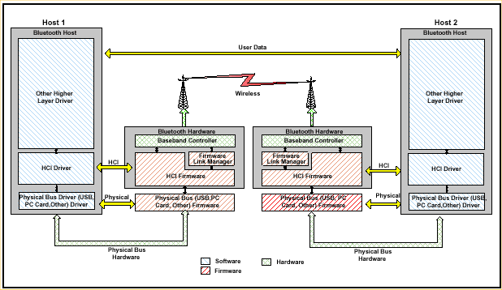
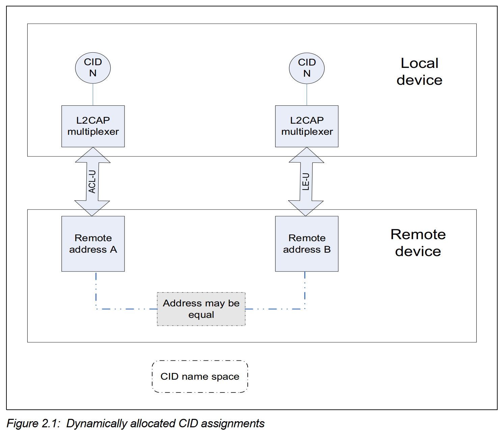
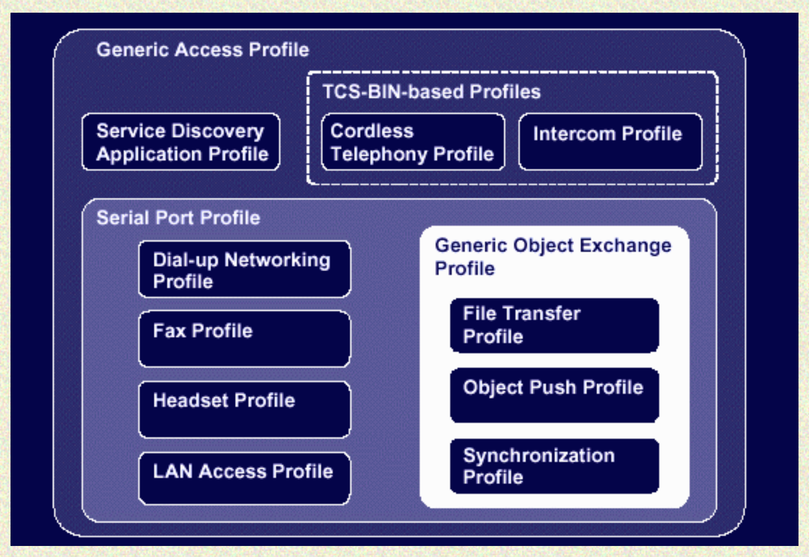

# 1. Radio Layer

# 2. Bluetooth Baseband Layer

Baseband是蓝牙的物理层(physical layer)，该层管理物理信道(physical channel)和链接(links)。该层位于Radio层之上。

Baseband protocol实现之后成为Link Controller，Link Controller和Link Manager共同完成link connection和power control的功能。

Baseband同时管理同步、异步link，并处理packet，完成paging，调查访问该区域的蓝牙设备等工作

## Physical Characteristics

### Physical Channel

Bluetooth工作在频分复用的物理信道上，通过伪随机跳变序列完成master和slave设备的频率(信道)同步。工作在同一个信道上的设备构成piconet。在一个piconet中，有一个master，1个或多个slaves。

同一个信道(channel)的设备通过时分复用的方式相互传输信息。

### Physical Links

Baseband有两种类型的link：SCO(Synchronous Connection-Oriented)和ACL(Asynchronous Connection-Less)。

SCO Link是1个master和1个slave对等的一对一连接。SCO主要用于传输voice信息。master可以支持最多3个SCO links，slave最多支持2-3个SCO links。SCO packets不能被重传。

ACL Link是一个master，多个slave的一对多连接。只能有一个ACL link，且ACL link可以重传。

### Logical Channels

Bluetooth有5个logical channels可以用于传输不同类型的信息。LC(Link Control Channel)和LM(Link Manager)信道用于link level。UA, UI, US信道用户携带异步、等同步和同步信息。

### Device Addressing

* BD_ADDR: Bluetooth Device Address
    每个蓝牙设备都关联48-bit的设备地址。
* AM_ADDR: Active Member Address
    3-bit的数值。只有在slave设备active在channel上时，AM_ADDR才有效。也被称为Bluetooth单元的MAC地址
* PM_ADDR: Parked Member Address
    8-bit的member(master-local)地址。划分了parked slaves
* AR_ADDR: Access Request Address
    用于parked mode。

## Packets

### Packet Types

一共13类packet。
* SCO, ACL共有：ID, NULL, POLL, FHS, DM1
* ACL专用：DH1, AUX1, DM3, DH3, DM5, DH5
* SCO专用：HV1, HV2, HV3, DV

### Packet Format

| ACCESS CODE | HEADER | PAYLOAD |
| --- | --- | ---|
| 72 bits | 54 bits | 0-2745 bits |

* ACCESS CODE: 用于timing synchronization, offset compensation, paging和inquiry。分为三种类型的Code：Channel Access Code(CAC), Device Access Code(DAC)和Inquiry Access Code(IAC)。CAC用于标识一个piconet，DAC用于paging和响应，IAC用于inquiry。
* HEADER：包含package确认、packet序列号、流控制、slave address和error check的相关信息
* Payload：包含具体的数据

## Channel Control

### Connection Setup

* Inquiry
Inquiry阶段，master发现可达范围内的设备，获取其他设备的device address，并同步通信的clock(可选)。
&nbsp;
* Paging
Paging阶段，master设备和slave设备完成connection的建立，并同步时分复用和频分复用的参数。

### Connection Modes

* Active Mode
* Sniff Mode: 周期性地listen to piconet，most power saving
* Hold Mode: medium power saving
    在ACL link下的两个device，如果他们之间不再传输数据，slavers就可以进入Hold Mode从而save power。在Hold Mode中的设备可以再次discover或者be discovered。
* Park Mode: listen to piconet and re-synchronize and check on broadcast。lowest power saving

## Other Baseband Functions

### Error Correction

通过发送冗余数据保证错误的纠正。

### Flow Control

ACL和SCO link使用FIFO方式发送数据，在队列满时由receiver向sender发送stop信号，从而停止发送；发送go信息，使得packet再次发送。

### Synchronization

涉及到时分复用的同步。

# 3. LMP (Link Manager Protocol)

Link Manager执行link setup, 认证, link配置等功能。它通过LMP协议发现其他的LM。为了表现出service provider角色，LM使用潜在的Link Controller服务。

# 4. HCI Layer
## HCI Functionality Entities

HCI(Host Controller Interface)架构主要分为三部分：HCI Firmware, HCI Driver, HCI Controller Transport Layer。

### HCI Firmware (located at: Host Controller)
HCI Firmware位于HCI Contoller端。
HCI Firmware主要实现了HCI Commands，这些Commands可以直接控制蓝牙硬件，通过accessing baseband commands, link manager commands, hardware status registers, control registers和event registers进而实现这些HCI Commands。

### HCI Driver (located at: Host)
HCI Driver位于Host端。
Host接收异步的HCI events，接收之后解析这些events从而知悉哪些事件发生。

### HCI Controller Transport Layer (located at: Intermediate Layers)
HCI Controller Tranport Layer位于Intermediate Layers。
HCI Controller Tranport Layer是HCI Driver和HCI Firmware交互的桥梁，这一层需要在不了解数据具体能力的情况下完成数据的传输。
这一层可以通过USB, UART, RS232实现。

## HCI Commands

HCI Commands提供了访问Bluetooth硬件的统一接口。
* HCI Link Commands: 为Host提供了控制link layer连接其他蓝牙设备的能力。这些命令通常涉及Link Manager与其他Bluetooth设备交互LMP命令。
* HCI Policy Commands: 控制Link Manager管理蓝牙网络，影响local和remote Link Manager的行为，控制网络连接。
* HCI Controller & Baseband Commands: 访问及控制Bluetooth硬件的不同能力。

# 5. L2CAP (Logical Link Control and Adaptation Layer Protocol)

L2CAP位于Baseband之上，并resident在data link层。它提供了面向连接和无连接的数据服务。它的功能包括协议复用能力、分段及组装操作、分组操作。L2CAP允许上层应用传输至多64KB的packet。

### Channel Identifiers

Channel identifiers(CIDs)代表设备上的logical channel end-point。

CID分为Reserved CID和Dymanic CID。Reserved CID包含特定的用途，Dynamic CID可以动态分配。

Dynamic CID与特定的logical link相关联。不同logical link可以分配相同的CID，因为通信时会综合logical link和CID鉴别packet。

# 6. RFCOMM

RFCOMM是一种简单的传输协议，它基于L2CAP协议模拟了RS232串口。RFCOMM支持两个设备之间最多60个模拟连接。连接的具体数量依赖于特定的平台。

## Overview

#### Device Types

* Type1 Devices: 通信终点，例如computer、printer
* Type2 Devices: 中间设备，例如modems

RFCOMM不对两种设备进行区分，有些信息同时支持在Type1和Type2设备之间的传输，有些设备只支持在Type2设备的传输。

#### Control Signals

RFCOMM模拟了9种RS-232接口的circuit(电路)信号：
Signal Common, Transmit Data, ...

#### Null Modem Emulation
Null Modem模拟non-data circuits的传输。

#### Multiple Emulated Serial Ports
模拟多种串口信号。最多60个连接。

DLCI(Data Link Connection Identifier)标识client和server应用之间的连接。一个DLCI由6bits表示，每个在两个设置之间的DLCI互相独立。

Client和Server应用可以驻留在一个RFCOMM Session的两端(endpoints)。每端的Client独立地建立连接，DLCI的value space通过RFCOMM server channel在两个通信的设备之间划分。

如果BT设备支持模拟多个串口，且支持不同BT设备之间的connection，RFCOMM必须支持运行TS07.10 multiplexer session。

## RFCOMM中TS07.10的改造

#### Media的改造

在TS07.10中的open flag和closing flag在RFCOMM中没有使用。

#### TS07.10 multiplexer Startup & Closedown Procedure

TS07.10中的Startup和Closedown阶段在RFCOMM中不支持。

在任何时刻，任意的设备对之间只存在一个RFCOMM Session。在建立新的DLC(Data Link Connection)时，初始化过程检测是否在remote设备存在RFCOMM Session，如果存在，则在这个Session上建立新的DLC。一个RFCOMM Session由两个endpoints的Bluetooth BD_ADDR标识。

#### DLCI Allocation with RFCOMM Server Channels

Client和Server应用可能同时存在于RFCOMM Session的两端，每端的Client都可以独立地建立连接，DLCI值通过RFCOMM Server Channel和一个Direction Bit共同决定。

#### Multiplexer Control Commands

在一些DLC建立之间，需要在Control Channel(DLC0)上执行一些命令，交换一些信息。

* Remote Port Negotiation (RPN) Command: 在新的DLC打开之间使用，在port setting改变时使用。
* Remote Line Status (RLS) Command: 用于指示remote port line的状态。
* DLC Parameter Negotiation (PN) Command: 在第一个DLC创建之间，强制使用。在使用时，尝试打开credit based控制流。

## Flow Control Methods

#### L2CAP Flow Control

#### RFCOMM Flow Control

#### Port Emulation Entity: Serial Flow Control

#### Credit Based Flow Control

## Other Entity Interaction

#### Port Emulation and Port Proxy Entities

# 7. Profiles

Profiles描述了如何实现用户模型(user models)，实际上描述了协议栈的垂直切片，对应了每层协议必须满足的选项，以及每层协议的参数范围。

Profile的提出降低了不同厂商的产品交互的风险。

下图描述了不同Profile的直接/间接依赖关系：

## 7.1 Generic Access Profile (GAP)

GAP Profile定义了蓝牙discovery和涉及连接的link management的一般过程，它是其他Profile的核心。
GAP主要描述了底层协议栈(LMP和Baseband)如何使用，同时包含一些L2CAP, RFCOMM和OBEX相关的安全内容。

#### Configurations/Roles

为了方便蓝牙通信的描述，声明了A-party和B-party两个角色。A-party是"主动"设备，例如在link建立阶段的paging device，以及对建立的link配置的initiator设备；B-party是"从动"设备，例如paged device和acceptor。

#### Profile Fundamentals

GAP Profile定义了Bluetooth通信的最基础过程。例如discovery蓝牙设备过程中获取设备名、标识符、设备基本功能的过程，定义了在蓝牙设备间创建bonds的基本过程，建立连接的基本过程。

## User Interface Aspects

#### 基本的参数

* 蓝牙设备地址(BD_ADDR): 48bits的地址，12位的16进制字符。
* 蓝牙设备名(User Friendly Name): 用户自定义的蓝牙设备名。最多248个字符，一般要求设备能够处理40个字符的Name。
* PIN码(Bluetooth Pass-Key)：用于认证两个设备。
* 设备类型(Device Type): 在设备discovery阶段，标识设备的类型以及设备支持的服务。

#### 配对

使用LMP层的pairing procedure完成配对，配对可以选择下面的一种完成：
1. 主动发起建立(bonding with passkey)：用户初始化bonding过程，显示地输入密码从而创建绑定(bond)
2. 被动请求建立(authenticate with passkey)：用户被请求输入密码，以完成建立。

## Modes

#### Discoverability Modes

在不同的discoverable模式下，对inquiry有不同的响应。

* Non-discoverable Mode: 不可以被discovery
* Limited discoverable Mode: 只需要在限定的时间周期、或临时的状态下可以被discovery
* General discoverable Mode：始终处于被discovery的过程

#### Connectability Modes

在不同的connectability模式下，对paging有不同的响应。

* Non-connectable Mode: 永远不会进入PAGE_SCAN状态
* Connectable Mode: 周期性地进入PAGE_SCAN state

#### Pairing Mode

在不同的Pairing模式，对paring有不同的响应。

* Non-pairable Mode: 对LMP_in_rand回应LMP_not_accepted
* Pairable Mode: 在pairable模式下，设备接受pairing，可以创建bond、或被remote device初始化。对LPM_in_rand会议LMP_accepted。

## Idle Mode Procedures

* **Inquiry**: general inquiry, limited inquiry
* **Discovery**: name discovery, device discovery
* **Bonding**
* **Link Establishment**
* **Channel Establishment**
* **Connection Establishment**
* **Addtional Connections Establishment**

## 7.2. GATT Profile

#### Attribute Protocol(ATT)

#### GATT Service

#### GATT Characteristic