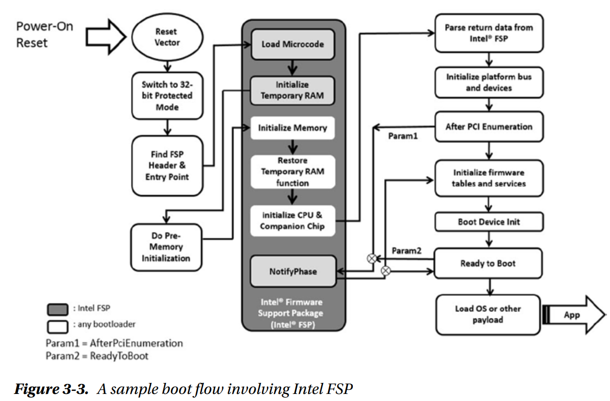

### CBFS

Bootblock位于CBFS最后20KB ROM空间中。Bootblock包含master header和加载Firmware的entry point。

### 执行过程

1. Bootblock: Reset Vector中包含一条跳转指令，可以跳转到Bootblock的16-bit的入口代码。Coreboot之后立刻进入32-bit的flat protected mode。
Reset Vector和Bootblock的代码都直接从ROM中运行，这种方式被称为XIP(execute in place)。此处可以执行受限的C代码，需要通过ROMCC编译器将C转为无栈的代码，由于ROMCC使用寄存器保存数据，所以C代码中的变量及调用链受限。

2. Romstage: 进入Romstage之后，首先需要设置"Cache as RAM(CAR)"。具体地，设置CAR的过程由Intel FSP等完成。完成CAR之后，可以执行C代码。

在此阶段，完成一般的硬件初始化(PCI, Memory I/O, System I/O)之前的初始化工作，例如可以配置串口输出debug信息，内存初始化等。

3. Ramstage: 进入Ramstage之后，内存已经完成初始化，Ramstage的代码也已经加载到内存中，并且已经可以完整地使用内存和CPU，包括堆栈/全局变量等。

Ramstage的目的是初始化I/O设备，additional application processors，SMM，最终将其整理成表传递给payloads或OS。

### coreboot源码分析

在获取`romstage`或`ramstage`时，会从头至尾搜索整个Flash，搜索到文件Header时，进一步判断是否为需要的stage file。搜索过程中步长为64B。搜索函数位于src/commonlib/bsd/cbfs_private.c:153(`cbfs_lookup()`)，及`cbfs_walk()`。

- 1. bootblock的启动
bootblock启动函数位于src/lib/bootblock.c中，`main()`及`bootblock_main_with_timestamp()`负责启动。在line 68中启动romstage(`run_romstage()`)。

在启动romstage时，涉及到函数`prog_run()`。

- 2. romstage的启动

在src/arch/x86/assembly_entry.S中完成"Cache as RAM(CAR)"的设置。
在设置完CAR之后，进入`car_stage_entry()`函数，位于src/arch/x86/romstage.c:8。在此函数内，执行初始化工作(src/cpu/intel/car/romstage.c:18 `romstage_main()`)，并调用postcar stage。

- 3. postcar的启动

完成CAR的销毁工作等。

postcar位于src/arch/x86/postcar.c:17 `main()`中，函数结尾调用`run_ramstage()`，启动ramstage阶段。

- 4. ramstage的启动

启动函数位于src/lib/hardwaremain.c:425 `main()`中。