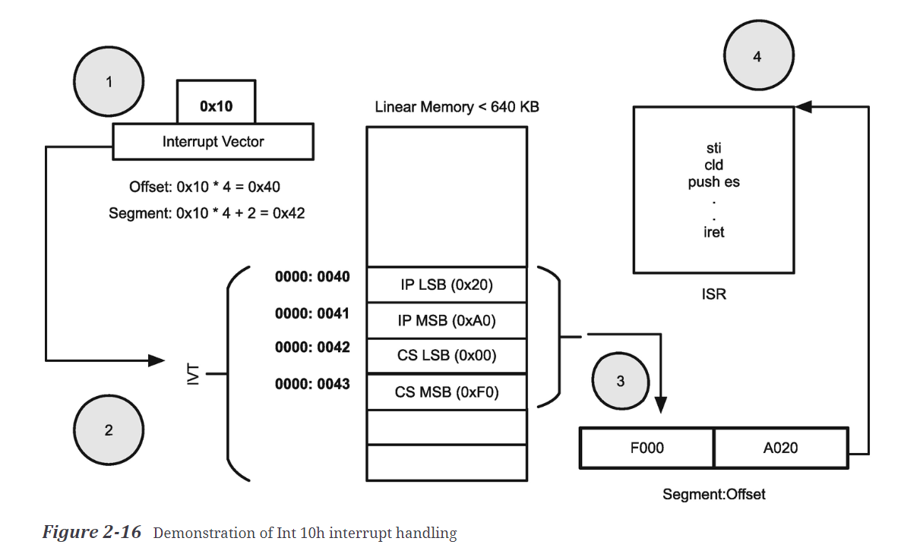

## Chapter2: Knowing Your Hardware

1. 计算机架构是硬件部件的组合。理解计算机系统需要理解硬件之间的互联性以及他们之间的数据传输。

2. 冯诺依曼架构：ALU+Control Unit构成CPU，Memory，IO Device，System Bus
3. 冯诺依曼架构中，指令地址和数据地址没有差别，地址对应的部分可以被执行的话就是指令，可以被修改的话就是数据。
Harvard架构中，将指令地址和数据地址进行了区分，其好处是可以同时进行数据的读和写操作。

4. ISA(Instruction Set Architecture): ARM, x86, RISC-V, MIPS, SPARC等等。
5. CISC(Complex Instruction Set Computer): 复杂指令集可以通过一条机器指令完成复杂的操作，CISC指令可以解决指令的存储占用，但是当前的优势不大。
RISC(Reduced Instruction Set Computer): 精简指令集将复杂的操作由硬件offload到软件设计上，软件占用更多的空间。
精简指令集的好处：
- 1. 可以涉及大量的寄存器
- 2. 解码单元更简单
- 3. 指令执行周期更短
- 4. RISC指令大多要求操作寄存器，操作数据更快
- 5. 

#### Processor Modes

x86处理器。

1. Real Mode: 所有地址操作都是真实的地址，运行在16-bit模式下，最多操作20-bit的地址空间(1MB)。每个段都是64KB的大小(16-bit)。

Real Mode中断的处理涉及Interrupt Vector Table，可以支持256个中断，每个中断处理例程关联4个bytes的地址，
IVT表共占用1KB(4*256=2^10)，保存在RAM的最底层1KB中。

寻址某个中断时，会根据中断号，查找对应的4B的地址，其中前2B为Segment, 后2B为Offset。

2. Protected Mode:
