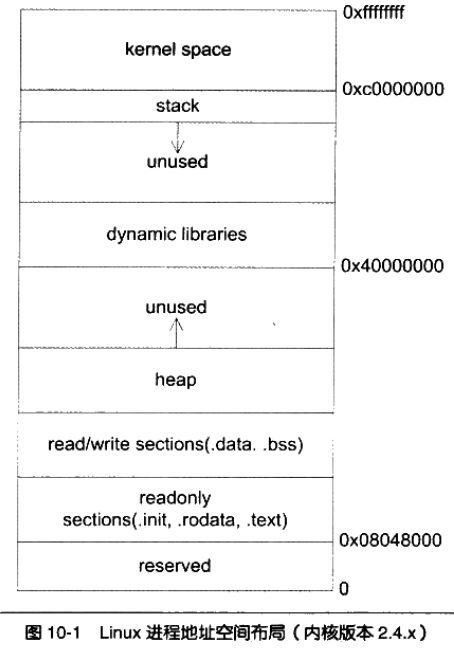
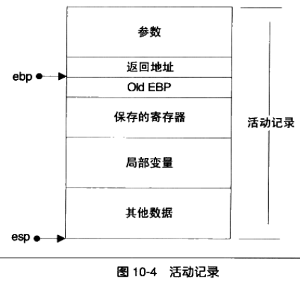
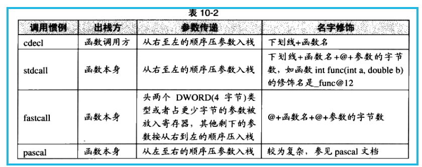

# 1. 程序的内存布局

* **保留区**: 不是单一的内存区域，而是内存中受到保护而禁止访问的内存区域的总称。

Linux中，动态链接库映射区从`0x40,000,000`开始的地址分配相应的空间。

# 2. 栈管理

## 2.1. 程序栈的布局

压栈的标准流程：

1. 函数参数从右向左入栈
2. 返回地址入栈
3. push ebp
4. mov ebp,esp (ebp=esp)
5. sub esp, XXX;   在栈上申请空间，保存局部变量
6. push XXX...; 保存必要的寄存器
======
子函数处理过程
======
7. pop XXX...; 恢复寄存器
8. mov esp,ebp (esp=ebp); 回收栈空间
9. pop ebp; 恢复上个栈帧
10. ret; 跳转调用处

## 2.2. 函数优化

C函数被声明为`static`或函数仅在本编译单元中直接调用，没有显示或隐式取地址时，编译器可以修改函数的（进入或退出指令）达到优化的目的。

## 2.3. 调用惯例

C语言中有多个调用惯例，通常是_cdecl的方式调用。

C++有更为复杂的名字修饰方式，并且还有特殊的调用惯例，称为`thiscall`。其实现方式根据编译器不同而不同，VC中将`this`指针保存到ecx寄存器，gcc将`this`作为函数的第一参数。

## 2.4. 函数返回值

* 小于4字节：通过`eax`返回
* 5-8字节：`eax`保存低4字节的内容，`edx`保存高4字节的内容
* 更长的返回值：在调用方申请栈作为返回值的空间。

*C++提出了返回值优化技术，对于返回值为构造对象时，直接在返回的对象上构造，减少拷贝构造调用。*

# 3. 堆与内存管理

