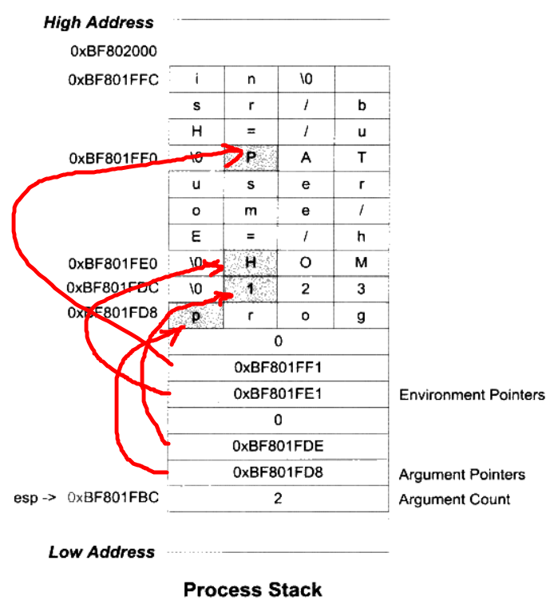
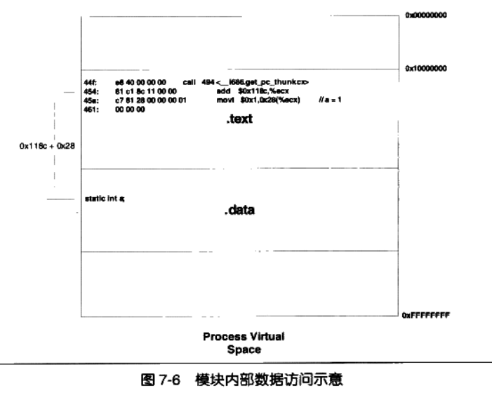
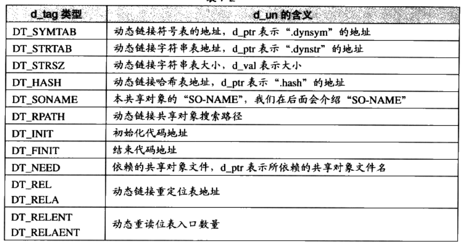

# 2. 编译和链接

## 整体流程

预处理(Prepressing), 编译(Compilation), 汇编(Assembly), 链接(Linking)

### 预编译

```bash
$ gcc -E hello.c -o hello.i
```

处理规则包括：
* 展开宏定义
* 处理条件预编译指令, #if, #ifdef ...
* include头文件
* 删除注释
* 添加行号和文件名标识
* 保留所有的#pragma指令

### 编译

```bash
$ gcc -S hello.i -o hello.s
```

### 汇编

```bash
$ as hello.s -o hello.o
# OR
$ gcc -c hello.s -o hello.o

# OR
$ gcc -c hello.c -o hello.o
```

### 链接

```bash
$ld -static hello.o ***.o ....
```

## 编译器操作

词法分析，语法分析，语义分析，中间语言生成，目标代码生成与优化

### 语法分析

`yacc`工具 (Yet Another Compiler Compiler)

生成语法树

### 语义分析

静态语义分析，包括声明和类型的匹配，类型的转换。

### 中间语言生成

编译器前端处理.

将语法树转换成**中间代码**, 通常形式是：**三地址码(Three-address Code)**, **P-代码(P-Code)**

### 目标代码生成和优化

编译器后端处理.

将中间语言转换成目标代码，包括代码生成器(Code Generator)和目标代码优化器(Target Code Optimizer).
该过程依赖特定的硬件平台.


### 静态链接

链接过程包括地址和空间分配(Address and Storage Allocation), 符号决议(Symbol Resolution), 和重定位(Relocation).

在源文件中，生成.o文件时，为全局变量预留*定位的位置*，并在*链接过程*进行定位就是重定位方式的一种。

# 3. 目标文件中有什么

### 目标文件的格式

Windows: PE文件(Portable Executable)
Linux: ELF文件(Executable Linkable Format)
两种都是COFF文件(Common File Format)的变体

ELF分为多类:
* 可重定位文件(Relocation File): 包含代码和数据，中间目标文件，包括.o(Linux)和.obj(Windows)
* 可执行文件(Executable File): 包含可以执行的程序，例如.exe
* 共享目标文件(Shared Object File): 包含代码和数据，动态链接库，.so(Linux)和.dll(Windows)
* 核心转储文件(Core Dump File): 进程终止时，保留的信息

### 目标文件的内容

ELF文件包括多段，包含代码、数据、符号表、调试信息和字符串等内容.

```
    ELF:

    File Header
    ------
    .text section
    -----
    .data section
    -----
    .bss section
```
其中，.text保存代码，.data保持初始化的全局变量和静态变量，.bss保存未初始化的全局变量和静态变量。

File Header中包括文件属性(静态链接、动态链接、可执行文件)，目标硬件、目标操作系统、**段表**。段表保存各个段在文件中的偏移地址和属性。.text只读，.data段可读写。

.bss段未分配物理空间，只描述了需要记录的未初始化的全局变量和局部静态变量的**大小总和**。

指令分段的好处：
1. 映射后的虚存可以分为只读、可读写两类
2. 指令、数据分离之后可以提高缓存命中率
3. 可以共享代码段，减少空间占用

```bash
# 查看代码段内容
$ objdump -s -d hello.o

# 查看文件段的结构
$ objdump -h hello.o

# 查看段的统计内容
$ objdump -S hello.o

# 查看各个段的大小
$ size hello.o

# 查看ELF文件头
$ readelf -h hello.o

# 查看符号表
$ readelf -s hello.o

# 查看符号表
$ nm hello.o

# 查看Program Header信息
$ readelf -l hello.o


## 动态链接 ##
# 查看动态链接库的文件头信息
$ readelf -d lib.so

# 查看可执行文件依赖的动态链接库
$ ldd HelloWorld

# 查看动态链接的动态符号表(.dynsym)及其哈希表(.hash)
$ readelf -sD lib.so

# 查看重定位表的内容
$ readelf -r lib.so

```

#### 代码段

.text段，可以通过`objdump`反汇编得到。

#### 数据段和只读数据段

.data段和.rodata段

.data段保存初始化的全局(静态)变量和局部静态变量；.rodata段保存**只读变量**和**字符串常量**。


## ELF File Header

保存ELF魔数、文件机器字节长度、数据存储方式、版本号、运行平台、ABI(Application Binary Interface)版本、ELF重定位类型、硬件平台、硬件平台版本、入口地址、程序头入口和长度、段表的位置和长度、段表的数量。

## 段表 (Section Table)

* 段名
* 段的类型：程序-数据段、符号表、字符串表、重定位表等
* 段的标志位：可写、需要分配空间、可执行等
* 段虚拟地址
* 段偏移
* 段长度
* 段链接信息：
* 段对齐地址
* 段项的长度

## 重定位表

包含静态链接时的定位信息，即代码段和数据段中那些对绝对地址引用的地址

## 字符串表

连续的字符串列表

* **.strtab**: String Table, 字符串表，保存普通字符串，例如符号名等
* **.shstrtab**: Section Header String Table, 段表字符串表，保存段表中用到的字符串，例如段名(sh_name)

## 符号表

符号表往往位于文件的一个段，段名 **.symtab**

* 符号名：包含在字符串表(.strtab)中的下标
* 符号对应的值
* 符号大小，4/8字节...
* 符号类型和绑定信息：全局/局部/弱引用符号，数据对象/函数/文件名/段名等符号
* 符号所在段：未定义/绝对值/COMMON块中

## 特殊符号

* __executable_start: 程序的起始地址
* __etext/_etext/etext: 代码段结束地址
* _edate/edate: 数据段结束地址
* _end/end: 程序结束地址
上述符号都是虚拟地址。

## 符号修饰和函数签名

对于变量car
* C语言：car或_car, GCC中可以通过-fleading-underscore或-fno-leading-underscore打开或关闭下划线
* C++语言：由命名空间、类名等决定修饰后的符号
  * 对于函数int N::C::func(int) --> _ZN1N1C4funcEi
  * 对于变量int N::C::val --> _ZN1N1C3val

## extern "C"

使用extern "C"修饰函数或变量，修饰后的函数/变量的符号按照C语言标准设置，否则按照C++语言设置

## 弱符号与强符号

* 强符号：函数, 初始化的全局变量
* 弱符号：未初始化的全局变量, 通过__attribute__((weak))指定的初始化全局变量
    ```c
        int weak;
        __attribute__((weak)) weak2 = 2;
    ```

强符号只能定义一次，弱符号可以定义多次，并使用size最大的类型作为其最终的类型。

* 强引用：未找到的符号，链接器报“未定义错误”
* 弱引用：未找到的符号不会报“未定义错误”，用户可以通过这种方式自定义扩展，库文件中常用这种方式
    ```c
    __attribute__((weakref)) void foo;
    int main()
    {
        if(foo) foo();
    }
    ```

# 4. 静态链接

## 重定位表

* r_offset: 重定位入口的偏移
* r_info: 重定位入口的类型和符号

```bash
# 查看重定位表
$ objdump -r hello.o

#查看符号表
$ readelf -s hello.o

# 列出系统所有的动态链接库
$ ldconfig -p

```

## 指令修正方式

* 绝对寻址修正(S+A)：修正的地址为符号的虚拟地址
* 相对寻址修正(S+A-P)：修正后的地址为符号的虚拟地址与当前指定地址的距离
(
A: 保存在被修正位置的值
P: 被修正的位置，也就是符号的虚拟地址
S：该符号在符号表的下标
)

## COMMON块

在编译之后，保存**未初始化的全局变量**，用于最终确定某个变量最终的大小。但是最终链接后的可执行文件中，未初始化的全局变量仍然放在**BSS**段。

为了防止程序员忘记给外部变量添加extern关键字，使用这种tricky的设计防止*重复定义*的错误。

比如a.c中var变量定义为int, b.c中var变量定义为double，则最终var变量的大小为8字节。

可以使用-fno-common或 *\__attribute\__*(`int global__attribute__((nocommon));`)禁止COMMON块。

## C++相关问题

### 重复代码消除

对于模板、外部内联函数和虚函数表，如果没有实例化的模板都有一个对应的副本，则会造成重复代码，引起空间浪费、地址容易出错、指令运行效率低下(Cache Miss增多)。

编译器常用方法：编译时生成多个副本，例如多个add<int>, add<double>，在链接时只选取其中的一个，其他的则忽略。这样的段在编译时命名为".gnu.linkonce.NAME"(eg. .gnu.linkonce.add)，在链接时选取一个这样的段。

### 函数级别链接

由于链接时，需要将整个.o文件加入可执行文件中，如果只用了.o中的一个函数，链接整个文件会增加可执行文件的体量。因此，可以把每个函数都拆为独立的段，如果只使用其中的一个段，则只链接这个段，其他的函数段不使用。

"-ffunction-sections"和"-fdata-sections"可以启用这种设计，将函数或变量保存到独立的段中。

### 全局构造和析构

main函数执行之前和之后需要一些操作，例如全局对象的构造和析构。

* init：该段保存进程的初始化代码，在main执行前调用
* fini：该段保存进程的终止代码，在main结束时执行


# 6. 可执行文件的装载

## ELF文件链接视图和执行视图

1. 相同权限的段合并后进行映射，链接以`section`的视图进行，执行以`segment`的视图进行。
2. 段权限(类型): LOAD, DYNAMIC, INTERP等
3. UNIX系统在执行`segment`到物理页的映射时，将多个`segment`组织到同一个物理页面，也就是将物理页面映射到多个VMA中

## 进程栈结构

```
    HOME=/home/usr
    ---
    PATH=***;***
    ---
    argv[0], argv[1], ...
    ---
    0
    ---
    Environment Pointers ...
    ---
    0
    ---
    Argument Pointers
    ---
    Argument Count
```


## Linux内核装载ELF过程

1. fork()系统调用创建新的进程
2. 新进程调用execve()系统调用执行指定的ELF文件，**开始真正的装载过程**。
   1. execve()被封装为execl(), execlp(), execle(), execv(), execvp()等多个API
3. execve()-->sys_execve()-->do_execve()。
   1. do_execve()读取ELF文件的前**128**个字节，判断文件的格式（ELF文件、Java文件、Shell脚本、Python等）
   2. 脚本程序第一行的`#!/bin/sh`, `#!/usr/bin/perl`前两个字节`#!`构成魔数
4. do_execve()调用search_binary_handle()从而搜索并匹配合适的可执行文件，从而得到文件对应的装载方法。
   1. ELF装载方法：load_elf_binary()
   2. a.out装载方法：load_aout_binary()
   3. 可执行脚本装载方法：load_script()
5. load_elf_binary装载过程
   1. 检查ELF可执行文件格式的有效性
   2. 寻找动态链接的".interp"段，设置动态链接器路径
   3. 根据可执行文件的程序头表，对ELF文件映射，比如代码、数据、只读数据
   4. 初始化ELF进程环境
   5. 将系统调用的返回地址修改为ELF可执行文件的入口点
      1. 静态链接程序：e_entry所指的地址
      2. 动态链接程序：动态链接器
   6. 装载完毕

# 7. 动态链接

进程之间代码段共享，数据段独享。

## 重定位技术

1. 链接时重定位(Link Time Relocation)
2. 装载时重定位(Load Time Relocation), 在Windows又称基址重置(Rebasing)
    * 装载时重定位的方法需要**修改指令**，没办法做到同一份指令在多个进程中共享


## 地址无关代码

通过在编译动态链接库时添加`-fPIC`属性，将代码部分设置为地址无关。

根据数据/代码、模块内部/外部分为4种情况：

1. 模块内部的函数调用、跳转等
    * 通过**相对地址调用**达到地址无关
2. 模块内部的数据访问，例如全局变量、静态变量
    * 模块构成一般是若干页的代码紧跟若干页的数据，所以指令与数据的相对位置是固定的，可以通过相对地址调用的方式得到**数据相对于当前指令的偏移**，从而访问数据
    * **静态变量**一定存在本模块中，所以可以通过相对偏移的方式访问
    * **全局变量**可能存在与其他模块中，所以使用**方式3**GOT段重定位的方式获取全局变量
3. 模块外部的数据访问，例如其他模块中的全局变量
    * GOT(Global Offset Table)段建立指向这些变量的指针数组，使用**相对地址调用引用GOT段的数据项**
    * GOT段保存在数据段
4. 模块外部的函数调用、跳转等
    * GOT段保存指向变量的指针数组



## 全局变量的地址无关代码

每个共享对象在.bss段为全局变量产生一个副本。
ELF共享库在编译时，默认把定义在模块内部的全局变量当作定义在其他模块的全局变量。
在链接时：(a). 如果某个全局变量有多个副本，则动态链接器选择占用空间最大的副本，把所有GOT段相关的地址指向唯一的副本；
(b). 如果某个全局变量在程序主模块中没有副本，则GOT指向本模块的副本。

多个进程之间的全局对象时独立的，同个进程的多个线程的对象时共享的。可以通过"线程私有存储"独立存储全局变量的副本。

## 延迟绑定PLT

延迟绑定：Lazy Binding
PLT: Procedure Linkage Table

ELF将GOT拆分为`.got`和`.got.plt`，其中`.got`保存全局变量引用的地址，`.got.plt`保存函数引用的地址。
`.got.plt`的前三项较特殊：
* 第一项保存`.dynamic`的地址，该段描述了本模块动态链接相关信息
* 第二项保存本模块的ID
* 第三项保存_dl_runtime_resolve()的地址，该函数用于重定位外部函数。

`.plt`保存延迟绑定外部函数的代码，其功能是`(a).` 在bar@GOT未重定位时，通过_dl_runtime_resolve(MODULE_ID, RELOC_SYN)找到RELOC_SYN对应符号的地址，`(b).` 如果已经重定位，则直接跳转到bar@GOT执行：

```asm
PLT0:
push *(GOT+4)   # ==> push "module id"
jump *(GOT+8)   # ==> jump _dl_runtime_resolve()
...
bar@plt:
jmp *(bar@GOT)
push n
jump PLT0
```

## 动态链接相关结构

### `.interp`段

`.interp`段存储一个字符串，表示`动态链接器`的路径。Linux中动态链接器的路径几乎都是"/lib/ld-linux.so.2"，这个路径通常是软链接，从而指向真正的动态链接器。

通过`readelf -l a.out | grep intepreter`查看动态链接器的路径。

### `.dynamic`段

`.dynamic`段保存了动态链接所需要的基本信息，是`Elf32_Dyn`结构数组。包括依赖于哪些共享对象、动态链接符号表的位置、重定位表的位置、初始化代码的位置等。

```c
typedef struct {
    Elf32_Sword d_tag;
    union {
        Elf32_Word d_val;
        Elf32_Addr d_ptr;
    } d_un;
} Elf32_Dyn;
```
其结构为一个类型值加上一个附加的数值或指针。具体的类型包括：


### 符号表：`.dynsym`, `.symtab`, `dynstr`, `.hash`段

`.dynsym`保存动态链接相关的符号，`symtab`保存所有的符号，包括`dynsym`的符号。

`.dynstr`保存`.dynsym`中的符号字符串表。

`.hash`是辅助的符号哈希表，加快符号的查找过程。

### 重定位表：`.rel.dyn`和`.rel.plt`

`.rel.dyn`相当于`.rel.text`，用于对**数据引用**的修正，修正的位置位于`.got`及数据段
`.rel.plt`相当于`.rel.data`，用于对**函数引用**的修正，修正的位置位于`.got.plt`段

```bash
# 查看重定位表
$ readelf -r Lib.so
```

重定位类型：
    * **R_386_GLOB_DAT**: 将符号的绝对地址填入`.got`段项, 修正数据引用
    * **R_386_JUMP_SLOT**: 将符号绝对地址填入`.got.plt`段项, 修正函数引用
    * **R_386_RELATIVE**: 基址重置(**Rebasing**)重定位

基址重置(**Rebasing**)用于重定位绝对地址引用，例如指针应用
```c
static int a;
static int *p = &a;
```
假设`a`相对于初始地址的偏移为B，则p=B。当共享对象装载到地址A时，变量`a`的真实值变为A+B，则同时需要对`p`修正，加上装在地址A。符号`p`就是基址重置(**R_386_RELATIVE**)的应用场景。

## 动态链接步骤和实现

### 动态链接器自举

由于动态链接器需要自己完成自己的装载，所以它不能依赖于任何共享对象。

动态链接器首先找到自己的GOT，然后对自身的重定位表和符号表重定位，从而才能使用全局变量和静态变量。

### 装载共享对象

动态链接器将可执行文件，共享对象和链接器本身的符号表合并到一个全局符号表(Global Symbol Table)中。

动态链接器装载共享对象时，将共享对象的符号加入全局符号表中，如果被装载的对象依赖其他的对象，则继续装载。装载的过程可以是深度遍历或广度遍历，通常为广度遍历。

全局符号接入(Global Symbol Interpose)：当一个符号需要被加入全局符号表时，如果相同的符号名已经存在，则后加入的符号会被忽略。

### Linux动态链接器实现

1. 动态链接器是静态链接的
2. 动态链接器本身是PIC

## 显示运行时链接

### dlopen

打开共享链接库，打开的同时执行`.init`段进行初始化:
```c
void *dlopen(const char *filename, int flag);
```

搜索动态链接库的顺序:
1. 环境变量LD_LIBRARY_PATH指定的目录
2. /etc/ld.so.cache文件中的路径
3. /lib, /usr/lib

参数`filename`: 如果参数`filename`为0，则返回全局符号表的句柄
参数`flag`: RTLD_LAZY(延迟绑定), RTLD_NOW(加载时绑定), RTLD_GLOBAL(将动态链接库中的符号合并到进程的全局符号表中)。RTLD_GLOBAL可以和RTLD_LAZY或RTLD_NOW共同使用。

### dlsym

搜索动态链接库句柄，查找符号地址。
```c
void *dlsym(void *handle, char *symbol);
```

### dlerror

每次调用dlopen(), dlsym()或dlclose()以后，可以使用dlerror()判断是否调用成功。返回char*表示错误信息，返回NULL表示调用成功。

### dlclose

卸载加载的动态链接库。卸载时(a). 执行`.fini`段，(b). 把相应符号从符号表中删除，(c). 取消进程空间跟模块的映射关系，(d). 关闭模块文件。
