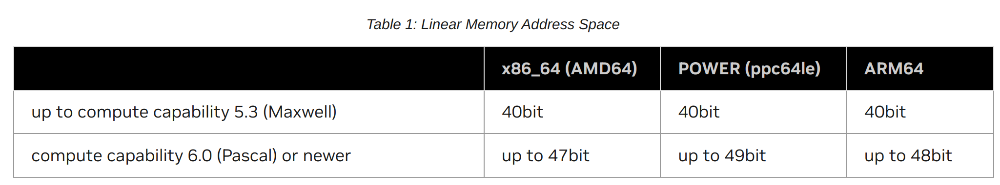

该文档主要总结了CUDA的programming guide部分。
https://docs.nvidia.com/cuda/cuda-c-programming-guide/index.html


# 1.1 初步感受
CUDA编程中涉及到了很多kernel之间并行化的方式，在文档中以Graph的方式呈现。

另外，CUDA做了很多Memory同步的工作，包括不限于host <-> device, device <-> device,同一个device内部的kernel之间的同步等，感觉他们在这个上边下了很大功夫。


### 3.2.1 Initialization

`cudaInitDevice()`和`cudaSetDevice()`用来初始化runtime和设置程序运行的设备。在用户未调用这两个函数时，默认会初始化device0以使用。

在初始化过程中，runtime会为device创建*primary context*，这个context会用于所有的kernels.

`cudaResetDevice`用来重置设备。

### 3.2.2 Device Memory

用户通过两种方式申请Device Memory：*linear memory*和*CUDA arrays*。*linear memory*用于绝大多数的kernel中，*CUDA arrays*用于texture fetching.

Linear memory通过unified address space进行寻址。所以host可以通过指针寻址device memory.地址空间的大小如下：



可以通过多个API申请Device Memory：
* `cudaMalloc()`, `cudaFree()`
* `cudaMallocPitch()`
* `cudaMalloc3D()`

#### # `cudaMalloc()`, `cudaFree()`

`cudaMalloc`申请一维的memory.

```c++
__global__ void vecAdd(float *vec, uint32_t size)
{
    int i = blockDim.x * blockIdx.x + threadIdx.x;
    if(i < size) {
        vec[i] += 1;
    }
}

int main()
{
    int N = 32;
    uint32_t size = N * sizeof(float);

    float *h_A;
    h_A = (float*)malloc(size);

    float *d_A;
    cudaMalloc(&d_A, size);

    cudaMemcpy(d_A, h_A, size, cudaMemcpyHostToDevice);
    vecAdd<<<1, 32>>>(d_A, size);
    cudaMemcpy(h_A, d_A, size, cudaMemcpyDeviceToHost);

    cudaFree(d_A);
    free(h_A);

    return 0;
}
```

#### # `cudaMallocPitch()`, `cudaMalloc3D`

`cudaMallocPitch()`及`cudaMalloc3D`申请2D或3D的memory. 这两个API申请memory时可以保证对row的对齐访问，因此通过`cudaMemcpy2D()`和`cudaMemcpy3D`复制时可以保证有良好的性能。在对`cudaMallocPitch()`申请的memory进行读写时需要使用返回的pitch.

```c++
// Host code
int width = 64, height = 64;
float* devPtr;
size_t pitch;
cudaMallocPitch(&devPtr, &pitch,
                width * sizeof(float), height);
MyKernel<<<100, 512>>>(devPtr, pitch, width, height);

// Device code
__global__ void MyKernel(float* devPtr,
                         size_t pitch, int width, int height)
{
    for (int r = 0; r < height; ++r) {
        float* row = (float*)((char*)devPtr + r * pitch);
        for (int c = 0; c < width; ++c) {
            float element = row[c];
        }
    }
}
```

另外，也可以使用`cudaMemcpyToSymbol()`和`cudaMemcpyFromSymbol()`进行`__constant__`和`__device__`声明的内存的读写。

```c++
__constant__ float constData[256];
float data[256];
cudaMemcpyToSymbol(constData, data, sizeof(data));
cudaMemcpyFromSymbol(data, constData, sizeof(data));

__device__ float devData;
float value = 3.14f;
cudaMemcpyToSymbol(devData, &value, sizeof(float));

__device__ float* devPointer;
float* ptr;
cudaMalloc(&ptr, 256 * sizeof(float));
cudaMemcpyToSymbol(devPointer, &ptr, sizeof(ptr));
```

### 3.2.3 Device Memory L2 Access Management

如果CUDA kernel多次访问global memory，这样的memory就是`persisting memory`。如果kernel只访问一次，这样的就是`streaming` memory.

CUDA支持将`persisting memory`放到L2 cache中。


#### 设置L2 Cache中用于persisting memory的大小

```c++
cudaGetDeviceProperties(&prop, device_id);
size_t size = min(int(prop.l2CacheSize * 0.75), prop.persistingL2CacheMaxSize);
cudaDeviceSetLimit(cudaLimitPersistingL2CacheSize, size); /* set-aside 3/4 of L2 cache for persisting accesses or the max allowed*/
```

#### 设置放置在persisting的global memory

在下述示例中，kernel访问`[ptr, ptr+num_bytes]`区域的global memory时，优先将其放置到persisting memory中。`hitRatio`表示是否放置到persisting的概率(当`hitProp`为`cudaAccessPropertyPersisting`).

设置`hitRatio`的优势是可以避免persisting memory的抢占。比如persisting memory的总大小是32KB，而且有两个stream对应的`num_bytes`都是32KB，如果他们的`hitRatio`都是1.0，就会导致互相之间逐出对方的persisting,但是如果是0.5,就不会有这种情况。

```c++
cudaStreamAttrValue stream_attribute;                                         // Stream level attributes data structure
stream_attribute.accessPolicyWindow.base_ptr  = reinterpret_cast<void*>(ptr); // Global Memory data pointer
stream_attribute.accessPolicyWindow.num_bytes = num_bytes;                    // Number of bytes for persistence access.
                                                                              // (Must be less than cudaDeviceProp::accessPolicyMaxWindowSize)
stream_attribute.accessPolicyWindow.hitRatio  = 0.6;                          // Hint for cache hit ratio
stream_attribute.accessPolicyWindow.hitProp   = cudaAccessPropertyPersisting; // Type of access property on cache hit
stream_attribute.accessPolicyWindow.missProp  = cudaAccessPropertyStreaming;  // Type of access property on cache miss.

//Set the attributes to a CUDA stream of type cudaStream_t
cudaStreamSetAttribute(stream, cudaStreamAttributeAccessPolicyWindow, &stream_attribute);
```

#### L2 Cache的类型

* `cudaAccessPropertyPersisting`
* `cudaAccessPropertyStreaming`
* `cudaAccessPropertyNormal`

#### 重置L2 Cache的类型

* 将`hitProp`设置为`cudaAccessPropertyNormal`
* 调用`cudaCtxResetPersistingL2Cache()`
* 依靠系统自动设置（不推荐）

### 3.2.5 Distributed Shared Memory

多个thread block之间可以组成Cluster，互相共享彼此的shared memory。

通过`cluster.sync()`同步memory.

组成cluster的大小通过runtime在启动kernel时进行配置，例如：

```c++
// Launch via extensible launch
{
  cudaLaunchConfig_t config = {0};
  config.gridDim = array_size / threads_per_block;
  config.blockDim = threads_per_block;

  // cluster_size depends on the histogram size.
  // ( cluster_size == 1 ) implies no distributed shared memory, just thread block local shared memory
  int cluster_size = 2; // size 2 is an example here
  int nbins_per_block = nbins / cluster_size;

  //dynamic shared memory size is per block.
  //Distributed shared memory size =  cluster_size * nbins_per_block * sizeof(int)
  config.dynamicSmemBytes = nbins_per_block * sizeof(int);

  CUDA_CHECK(::cudaFuncSetAttribute((void *)clusterHist_kernel, cudaFuncAttributeMaxDynamicSharedMemorySize, config.dynamicSmemBytes));

  cudaLaunchAttribute attribute[1];
  attribute[0].id = cudaLaunchAttributeClusterDimension;
  attribute[0].val.clusterDim.x = cluster_size;
  attribute[0].val.clusterDim.y = 1;
  attribute[0].val.clusterDim.z = 1;

  config.numAttrs = 1;
  config.attrs = attribute;

  cudaLaunchKernelEx(&config, clusterHist_kernel, bins, nbins, nbins_per_block, input, array_size);
}
```

### 3.2.6 Page-Locked Host Memory

在host端通过`malloc()`申请的内存是可变page的内存，CUDA提供了一套API申请不可变Page的内存。

* `cudaHostAlloc()`和`cudaFreeHost()`用于申请和释放Page-locked host memory
* `cudaHostRegister()`用来将`malloc()`申请的内存注册为pag-locked memory

使用page-locked memory有很多益处，主要是方便了host/device memory的同步，另外还有可能增加throughput.

#### Portable Memory

* `cudaHostAlloc(..., cudaHostAllocPortable)`
* `cudaHostRegister(..., cudaHostRegisterPortable)`

page-locked memory可以用于多个devices.

#### Write-Combine Memory

申请的host memory如果是write-combine，这些memory就不会被L1/L2缓存。这样的好处是缓解了缓存的压力，缺点是会降低read的性能。所以一般只将用于write的memory置为write-combine.

* `cudaHostAlloc(..., cudaHostAllocWriteCombined)`

#### Mapped Memory

通过该方式申请的memory会将host和device memory进行映射，这样的好处是
1. 用户不需要显式地申请device memory并将数据拷贝到device，这种申请和拷贝的操作会隐式地进行。
2. 不需要使用streams将拷贝的操作覆盖于kernel执行之间，kernel需要的数据会自动被拷贝(***???应该只是隐藏了host memory -> device memory的拷贝过程，需要进一步确定***).

* `cudaHostAlloc(..., cudaHostAllocMapped)`
* `cudaHostRegister(..., cudaHostRegisterMapped)`

申请的page-locked host memory可以被映射到device地址空间。使用`cudaHostAlloc(..., cudaHostAllocMapped)`或`cudaHostRegister(..., cudaHostRegisterMapped)`可以申请一块在host memory又映射到device空间的block。

在device端通过`cudaHostGetDevicePointer()`获取该block的指针，该指针能直接在kernel中被使用。注意该block仍在host端，但是在device访问时，系统会适时地将host的memory拷贝到device进行访问，这种行为是隐式地发生的。

通过这种方式访问Host memory的好处是不需要显式地进行host-device的拷贝，而且不需要使用stream将kernel执行和host memory访问进行overlap，系统会自动地进行overlap。

**注意**：当使用Unified Memory Space时，不再需要通过`cudaHostGetDevicePointer()`获取在kernel中使用的指针，可以直接使用`cudaHostAlloc()`返回的指针用于kernel之中。

**有很多Mapped Memory的细节需要后续学习关注**


### Memory Synchronization Domains

在kernel启动时可以设置kernel运行的上下文从而配置相应地。。。。


### 3.2.8 Asynchronous Concurrent Execution

CUDA提供了多种并行化的手段，包括：
* host端计算
* device端计算
* copy host <-> device
* copy inner device
* copy among devices

#### Host与Device间的并发执行（Concurrent Execution between Host and Device）

Host与Device之间的代码在以下条件可以并发执行：
* Kernel启动
* Device内的memory拷贝
* host -> device拷贝，且拷贝的memory小于64KB
* 以`Async`前缀的memory操作
* memory set函数

程序员可以通过设置环境变量`CUDA_LAUNCH_BLOCKING`全局地禁用kernel启动的异步执行。在使用profiling工具时(Nsight, Visual Profiler)会同步启动Kernel.

如果host memory不是page-locked，`Async`操作也会是同步的。

#### 并发地执行Kernel（Concurrent Kernel Execution）

通过检查`concurrentKernels`device property，查看GPU设备是否支持并发执行Kernels.

#### 并发地进行数据传输和Kernel执行（Overlap of Data Transfer and Kernel Execution）

通过检查`asyncEngineCount` device property，查看设备是否支持内存拷贝和kernel执行并发执行。

在memory拷贝时如果涉及到host memory，则其必须是page-locked.

#### 并发地进行数据传输（Concurrent Data Transfer）

通过检查`asyncEngineCount` device property，查看设备是否支持.

#### Streams

Stream提供了一套关联多个Kernel或数据拷贝的方式。Stream中的Commands会顺序地执行。不同Streams中的Commands会无序地执行。

在Command满足Dependency之后，Command会自动执行。一个Command可能依赖于当前Stream之前的Commands或者其他Stream中的Commands.

##### 1. 相关APIS

```c++
cudaStream_t stream[2];
for (int i = 0; i < 2; i ++) {
    cudaStreamCreate(&stream[i]);
}

float *hostPtr;
cudaMallocHost(&hostPtr, 2 * size);

for (int i = 0; i < 2; i++) {
    cudaMemcpyAsync(inputDevPtr + i * size, hostPtr + i * size,
            size, cudaMemcpyHostToDevice, stream[i]);
    MyKernel<<<32, 64, 0, stream[i]>>>(outputDevPtr + i * size,
            inputDevPtr + i * size, size);
    cudaMemcpyAsync(hostPtr + i * size, outputDevPtr + i * size,
            size, cudaMemcpyDeviceToHost, stream[i]);
}

for (int i = 0; i < 2; i++) {
    cudaStreamDestroy(steam[i]);
}

```

在编译时配置选项`--default-stream per-thread`或`-DCUDA_API_PER_THREAD_STREAM=1`时，每个host thread都会有一个默认的thread.

在编译时配置选项`--default-stream legacy`或者不配置，则默认会使用`NULL stream`。`NULL stream`是device的所有thread共享的stream，它会引起隐式地同步。

##### 2. 显式地同步

通过调用下述API可以显式地进行stream的同步。
* `cudaDeviceSynchronize()`：等待所有host thread的所有stream都执行完成。
* `cudaStreamSynchronize(strem_id)`：等待`stream_id`里边的所有commands都执行完成。
* `cudaStreamWaitEvent(stream_id, event_id)`：设置`stream_id`的后续commands等待`event_id`发生之后再执行。 
* `cudaStreamQuery(stream_id)`：查询`stream_id`里的commands是否都执行完成。

##### 3. 隐式地同步

如果两个Streams中的Commands中存在以下行为，那这两个Commands不能并发地执行。
* 申请page-locked host memory
* 申请device memory
* 设置device memory（写入值）
* 两个address向通过一个device address写入
* 任何NULL stream中的commands都不能与其他stream并发执行

##### 4. Overlapping

Overlapping通常是指stream之间的overlapping。包含三种形式：Overlapping of Data Transfer and Kernel Execution, Concurrent Kernel Execution, Concurrent Data Transfer.

**举例**
在Example1中，如果设备支持Overlapping of Data Transfer and Kernel Execution，但不支持Concurrent Data Transfer, 该代码也不会有任何形式的并发。因为stream[1]的host->device是在stream[0]的device->host之后发起的，由于data transfer不支持concurrent, 所以无法达成并发。但是在Example2中可以达成并发，stream[0]的kernel execution和stream[1]的host->device可以overlapping.

另外，如果支持Concurrent Data Transfer, stream[1]的host->device可以和stream[0]的device->host overlapping, 有可能还可以与stream[0]的kernel execution overlapping.

```c++
// Example 1
for(int i = 0; i < 2; i++) {
    // copy from host to device on stream[i]
    // kernel execution on stream[i]
    // copy from device to host on stream[i]
}

// Example 2
for(int i = 0; i < 2; i ++) {
    // copy from host to device on stream[i]
}
for(int i = 0; i < 2; i ++) {
    // kernel execution on stream[i]
}
for(int i = 0; i < 2; i ++) {
    // copy from device to host on stream[i]
}
```

##### 5. Host Functions(Callbacks)

runtime通过`cudaLaunchHostFunc()`向开发者提供了一种在stream之间执行host函数的方式。任何在该函数之后的commands都需要等待host函数执行完毕才能运行。

```c++
void CUDART_CB MyCallback(void *data){
    printf("Inside callback %d\n", (size_t)data);
}
...
for (size_t i = 0; i < 2; ++i) {
    cudaMemcpyAsync(devPtrIn[i], hostPtr[i], size, cudaMemcpyHostToDevice, stream[i]);
    MyKernel<<<100, 512, 0, stream[i]>>>(devPtrOut[i], devPtrIn[i], size);
    cudaMemcpyAsync(hostPtr[i], devPtrOut[i], size, cudaMemcpyDeviceToHost, stream[i]);
    cudaLaunchHostFunc(stream[i], MyCallback, (void*)i);
}
```
在`cudaLaunchHostFunc()`中执行的host函数不能直接或间接地执行CUDA API,否则可能导致死锁。

##### 6. Stream Priorities

可以配置stream的优先级，高优先级的stream优先被调用。

```c++
int priority_high, priority_low;
cudaDeviceGetStreamPriorityRange(&priority_low, &priority_high);

cudaStream_t st_high, st_low;
cudaStreamCreateWithPriority(&st_high, cudaStreamNonBlocking, priority_high);
cudaStreamCreateWithPriority(&st_low, cudaStreamNonBlocking, priority_low);
```

#### 3.2.8.7 CUDA Graph


##### 3.2.8.7.1 Graph Structure

1. **Node Types**

* kernel
* CPU function call
* memory copy
* memset
* empty node
* waiting on an event
* recoding an event
* signaling an external semaphore
* waiting on an external semaphore
* conditional node
* child graph


2. **Edge Data**

看不懂！！！

##### 3.2.8.7.2 Creating Graph using Graph API

如下代码创建依赖图：


```c++
cudaGraphCreate(&graph, 0);

cudaGraphAddKernelNode(&a, graph, NULL, 0, &nodeParams);
cudaGraphAddKernelNode(&b, graph, NULL, 0, &nodeParams);
cudaGraphAddKernelNode(&c, graph, NULL, 0, &nodeParams);
cudaGraphAddKernelNode(&d, graph, NULL, 0, &nodeParams);

cudaGraphAddDependencies(graph, &a, &b, 1);
cudaGraphAddDependencies(graph, &a, &c, 1);
cudaGraphAddDependencies(graph, &b, &d, 1);
cudaGraphAddDependencies(graph, &c, &d, 1);
```

##### 3.2.8.7.3 Creating Graph using Stream Capture

```c++
cudaGraph_t graph;

cudaStreamBeginCapture(stream);
kernel_A<<<..., stream>>>();
kernel_B<<<..., stream>>>();
libraryCall(stream);
kernel_C<<<..., stream>>>();
cudaStreamEndCapture(stream);
```

```c++
cudaStreamBeginCapture(stream1);
kernel_A<<<..., stream1>>>();

cudaEventRecord(event1, stream1);
cudaStreamWaitEvent(stream2, event1);

kernel_B<<<..., stream1>>>();
kernel_C<<<..., stream2>>>();

cudaEventRecord(event2, stream2);
cudaStreamWaitEvent(strea1, event2);

kernel_D<<<..., stream1>>>();

cudaStreamEndCapture(stream1, &graph);
```

##### 3.2.8.7.5 Updating instantiated Graphs

将CUDA Graph创建好之后，可以通过一些API更新整张图，也可以更新图的一部分。更新时需要使用的API各有不同。
更新整张图的开销大于更新部分节点的开销。

##### 3.2.8.7.8 Conditional Graph Node

* Conditional IF nodes
* Conditional WHILE nodes


#### 3.2.8.8 Events

```c++
cudaEvent_t start, stop;
cudaEventCreate(&start);
cudaEventCreate(&stop);

cudaEventDestroy(start);
cudaEventDestroy(stop);
```

通过Event进行计时：
```c++
cudaEventRecord(start, 0);
// do something
cudaEventRecord(stop, 0);
cudaEventSynchronize(stop);
float time;
cudaEventElapsedTime(&time, start, stop);
```

#### 3.2.8.9 Synchronize Calls

### 3.2.9 Muti-Device System

##### 3.2.9.1 Device Enumeration

`cudaGetDeviceProperties(&prop, 0)`

```c++
int deviceCount;
cudaDeviceCount(&deviceCount);
int device;
for (device = 0; device < deviceCount; device++) {
    cudaDeviceProp prop;
    cudaGetDeviceProperties(&prop, device);
    printf("Device %d has compute capability %d.%d\n",
        device, prop.major, prop.minor);
}
```

##### 3.2.9.2 Device Selection

默认使用device0.
`cudaSetDevice(0)`;

```c++
size_t size = 1024 * sizeof(float);
cudaSetDevice(0);            // Set device 0 as current
float* p0;
cudaMalloc(&p0, size);       // Allocate memory on device 0
MyKernel<<<1000, 128>>>(p0); // Launch kernel on device 0
cudaSetDevice(1);            // Set device 1 as current
float* p1;
cudaMalloc(&p1, size);       // Allocate memory on device 1
MyKernel<<<1000, 128>>>(p1); // Launch kernel on device 1
```

##### 3.2.9.3 Stream and Event Behaviour

如果一个kernel关联在某个stream上，但是该stream并不是创建在当前选择的device，kernel的启动会失败。

```c++
cudaSetDevice(0);
cudaStream_t s0;
cudaStreamCreate(&s0);
MyKernel<<<100, 64, 0, s0>>>();

cudaSetDevice(1);
cudaStream_t s1;
cudaStreamCreate(&s1);
MyKernel<<<100, 64, 0, s1>>>();

MyKernel<<<100, 64, 0, s0>>>(); // s0创建在device0, 启动失败
```

* `cudaEventRecord()`: fail，如果输入的event和stream在不同设备
* `cudaEventElapsedTime()`: fail，如果参数event在不同的设备
* `cudaEventSynchronize`/`cudaEventQuery()`：success，如果参数event在另一个设备
* `cudaStreamWaitEvent()`：success，如果参数event和stream分别在不同的device. 可以通过它来同步不同的设备。

#### 3.2.9.4 Peer-to-Peer Memory Access

端到端设备可以通过PCIe或NVLink互相访问内存（也就是一个在某个设备上运行的kernel可以通过指针访问另一个设备的地址空间）。在`cudaDeviceCanAccessPeer()`为true时，表示可以进行两个设备端到端的内存访问。

端到端的访问只在64位的应用上支持，并且两个设备都需要设定`cudaDeviceEnablePeerAccess()`.

如下所示，两个设备使用了统一内存地址空间（Unified Address Space），因此两个设备可以使用同一个指针进行访问。
```c++
cudaSetDevice(0);
float *p0;
size_t size = 1024 * sizeof(float);
cudaMalloc(&p0, size);
MyKernel<<<100, 128>>>(p0);

cudaSetDevice(1);
cudaDeviceEnablePeerAccess(0, 0);   // 在device1上启动对device0的Peer-to-Peer access
MyKernel<<<100, 128>>>(p0); // 在device1也能执行kernel，并且可以访问p0
```

在使用Unified Address Space时，device之间隐式地进行memory的访问，但是如果不使用Unified address,则需要用户显式地调用API进行memory的交换。

* `cudaMemcpyPeer()`
* `cudaMemcpyPeerAsync()`
* `cudaMemcpy3DPeer()`
* `cudaMemcpy3DPeerAsync()`

```c++
cudaSetDevice(0);
float *p0;
size_t size = 1024 * sizeof(float);
cudaMalloc(&p0, size);

cudaSetDevice(1);
float *p1;
cudaMalloc(&p1, size);

cudaSetDevice(0);
MyKernel<<<100, 10>>>(p0);

cudaSetDevice(1);
cudaMemcpyPeer(p1, 1, p0, 0, size); // 需要显式地进行device之间的内存拷贝
MyKernel<<<100, 10>>>(p1);
```

这些Peer内存拷贝的操作的执行时机有限制
* 1. 在队列之前的其他API执行完毕之后才执行copy操作
* 2. 在copy运行完毕之后，队列之后的API才能执行。

### 3.2.10 Unified Virtual Address Space

在64bit的应用程序中，所有compute capability大于等于2.0的设备都可以使用Unified Address Space。

* 通过`cudaPointerGetAttributes()`可以查询memory的位置位于host或device
* 在使用unified address space时，copy to或from device memory时，可以直接使用`cudaMemcpy*(..., cudaMemcpyDefault)`决定指针的位置。
* 在使用unified address space时，`cudaHostAlloc()`返回的指针可以直接在kernel中使用。不需要在使用`cudaHostGetDevicePointer()`获取device的指针。

### 3.2.11 Interprocess Communication

通过IPC API可以进行进程间的内存通信，IPC API只支持compute capability大于等于2.0且64bit的应用中。

* `cudaIpcGetMemHandle()`：获取用于进程间通信的device memory handler，然后可以通过标准进程间通信的方式发送给其他进程。
* `cudaIpcOpenMemHandle()`：从handle中获取其他进程的device memory pointer。

典型场景：一个主进程生成一批数据，子进程直接使用而不需要再次生成或拷贝。

### 3.2.12 Error Checking

在执行CUDA API后，会降错误状态写入到每个host thread独有的变量中，用于可以通过API查询执行CUDA API之后的状态。

* `cudaPeekAtLastError()`：获取最新的错误状态，并且不重置error变量。
* `cudaGetLastError()`：获取最新的错误状态，并且重置error。

需要注意，对于asynchronous函数，error变量中只是记录了开始执行的错误状态（例如参数错误），而运行时的错误并不能被记录，可以通过`cudaDeviceSynchronize()`进行同步，同步完成之后可以得到运行时的错误状态。

### 3.2.13 Call Stack

* `cudaDeviceGetLimit()`：获取call stack的size。
* `cudaDeviceSetLimit()`：设置call stack的size。

