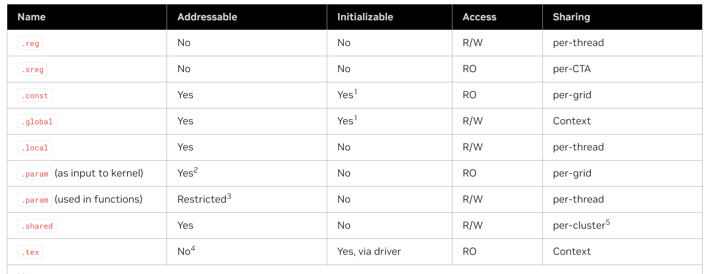

# Introduction

GPU可以被广泛应用在计算密集型的应用中。因为每个数据都执行相同的程序，所以对于复杂的流控制要求较低；同时因为执行在很多数据对象而且有较高的数据密度，所以数据访问的延迟会被计算所隐藏。


## PTX的优势

PTX(Prarallel Thread Execution)提供了一套稳定的编程模型和指令集。高级编程语言例如CUDA/C++可以生成PTX指令，PTX进一步地优化并翻译成目标架构的指令。

1. 提供了一套可以应用在多代GPU产品上的稳定的ISA
2. 最大化利用GPU的性能
3. 为C/C++等提供一套机器独立的编译环境
4. 为转码器提供一套共同的源代码级别的ISA
5. 便于库/内核/测试的编写
6. 提供了一套可以跨越多个并行单元的编程模型

# Programming Model

## Cooperative Thread Arrays (CTA)

CTA是指并发或并行地执行同一个kernel的线程组。

同一个CTA之内的线程可以互相通信，并且可以指定同步点，使得其他的所有threads等待当前同步点。


在CTA中的每个thread都有一个对应的ID，程序将数据/任务/结果划分成并行的部分给予每个CTA。每个CTA使用其ID决定需要处理的任务/数据。

每个thread有一个三维的`tid`(`tid.x`, `tid.y`, `tid.z`)；每个CTA有一个三维的`ntid`(`ntid.x`, `ntid.y`, `ntid.z`)，表示每维thread的个数。

CTA中的thread执行在SIMT的`warp`中，每个`warp`的thread执行相同的指令，并且被序列地编码，通常一个`warp`包含32个threads。

## Cluster of Cooperative Thread Arrays

Cluster of CTA可以并行或并发地运行，并通过shared memory进行通信。

在CTA之上再出现已成Cluster of CTA是硬件所决定的。一个硬件包含是的并行单元是固定的，CTA如果只在其中一个硬件上执行是可以完成任务的，但是可能会造成其他硬件的浪费，造成并发度较低。所以引入Cluster of CTA之后，任务可以分发在多个独立的硬件上，这些独立硬件之间可以通过总线等方式进行shared memory的通信。

在cluster中的CTA有独立的ID`cluster_ctaid`，每个cluster有`cluster_nctaid`表示CTA的个数。他们也都是三维的。

cluster只在`sm_90`及以上的架构上支持。如果没有显示地执行cluster level，默认是1*1*1。

## Grid of Clusters

CTA中的threads个数和cluster中的CTA个数都有限制。然而，全部的clusters可以组织成grid中多批clusters，因此一个kernel可以调用很多threads。但是组织成多批会造成不同批次之间的threads不能相互通信或同步。

每个grid也都有一个`gridid`。thread/cluster/grid id及个数都可以通过预定义的寄存器进行访问`%tid`, `%ntid`, `%clusterid`, `%nclusterid`, `%gridid`。

在grid中的每个CTA都有一个`ctaid`，以及`nctaid`。这两个都是三维的。

## Thread Hierarchy

线程的组织架构总共可以分为两类，分别是
1. thread -> CTA -> grid
2. thread -> CTA -> cluster -> grid


# Memory Hierarchy


# PTX Machine Model

## SIMT Multiprocessors

NVIDA GPU基于一组可扩展的multithreaded SMs(Streaming Multiprocessors)。在Host调用kernel grid时，grid中的blocks会遍历分发给SMs，每个SM对应一个thread block。

一个multiprocessor(SM)包含多个SP(Scalar Processor) cores，一个指令单元和on-chip shared memory。multiprocessor创建、管理、并发地执行，且可以零负载地调度，这就使得每个thread可以高效地运行。

multiprocessor将threads组织成wrap，一个warp中的threads并行、独立地运行。

warp中的threads从统一的地址执行程序，但是可以独立地执行分支，不同的thread通过active mask控制是否参与运算。

一个multiprocessor一次可以运行多少thread/warp取决于每个thread需要的registers和shared memory的大小。如果没有thread需要的足够大的registers/shared memory，启动就会失败。


## Independent Thread Scheduling

从Volta架构开始，每个thread都可以维护各自的IP和调用栈，独立性更强，调度更不容易出问题。

**对于warp的影响有点没看懂**。

## On-chip Shared Memory

* 每个processor有一个32-bit的寄存器
* parallel data cache/shared memory由所有的processor cores共享
* read-only *constant cache*
* read-only *texture cache*

# PTX Syntax

## Source Format

    #include, #define, #if, #ifdef, #else, #endif, #line, #file

## Comment

与C/C++一样，有`/**/`和`//`。

## Statements

```
        .reg     .b32 r1, r2;
        .global  .f32  array[N];

start:  mov.b32   r1, %tid.x;
        shl.b32   r1, r1, 2;          // shift thread id by 2 bits
        ld.global.b32 r2, array[r1];  // thread[tid] gets array[tid]
        add.f32   r2, r2, 0.5;        // add 1/2
```

### Directive Statements

Directive关键字以点起始，包含了一些预定义的标识符。

### Instruction Statements

Instruction关键字指PTX支持的指令。例如`abs`, `add`等。

### Identifiers

标识符遵循extended C++规则。另外，可以将%作为起始字符，以%开头的字符是系统定义的变量。

    followsym:   [a-zA-Z0-9_$]
    identifier:  [a-zA-Z]{followsym}* | {[_$%]{followsym}+

### 常量

整数常量、浮点数常量、常量表达式。

# State Spaces, Types and Variables

## State Spaces

在NVidia GPU中，根据存储/状态空间的访问速度和权限等，将状态空间分为8种：
* reg: 寄存器；per-thread
* sreg: specific reg；per-CTA
* const: shared；per-grid
* global: context
* local: per-thread
* param: shared; per-thread/per-grid
* shared: per-cluster
* tex: global texture memory



### Register State Space

`.reg`

每个thread独有的空间，速度最快。

### Special Register

`.sreg`

预定义的、平台相关的寄存器，例如grid, cluster, CTA, thread parameters, clock count, performance monitoring registers等。

### Constant State Space

`.const`

通过`ld.const`,`st.const`访存。10个64KB的区域，共有640KB，且不同区域可能物理上不连续。

### Global State Space

`.global`

通过`ld.global`, `st.global`, `atom.global`访问。可以被所有grids, clusters, CTAs, threads访问。

### Lobal State Space

`.local`

通过`ld.local`, `st.local`访问。每个thread私有的存储区域，大小受限。

在编程时，需要将`.lobal`的变量定义在function scope中，并且在栈上分配。不能使用递归函数调用。

### Parameter State Space

`.param`

通过`ld.param`和`st.param`访问。通过`mov`指令可以将参数地址存储到寄存器中。

param空间主要用途：(1)将host中的input参数传递给kernel；(2a)预分配空间用于返回值；(2b)为function parameter预分配空间，用来传递较大的结构体。

device function parameter和kernel function parameter是不同的参数，在PTX2.0中支持了device function parameter。

#### Kernel Function Parameters

Kernel parameter被一个grid中的所有threads共享。参数值可能是单个数值，也可能是constant/global/local/shared spaces中的地址。

通过`.ptr`语法表示参数是否为指针。align值设置了对齐的大小，如果不设置则为默认4字节对齐。

```
.param .type .ptr .space .align N  varname
.param .type .ptr        .align N  varname

.space = { .const, .global, .local, .shared };
```

#### Device Function Parameters

Device parameter的最普遍的用法是传递大小超过寄存器的结构体。
```
// pass array of up to eight floating-point values in buffer
.func foo ( .param .b32 N, .param .b32 buffer[32] )
{
    .reg .u32  %n, %r;
    .reg .f32  %f;
    .reg .pred %p;

    ld.param.u32 %n, [N];
    mov.u32      %r, buffer;  // forces buffer to .local state space
Loop:
    setp.eq.u32  %p, %n, 0;
@%p: bra         Done;
    ld.local.f32 %f, [%r];
    ...
    add.u32      %r, %r, 4;
    sub.u32      %n, %n, 1;
    bra          Loop;
Done:
    ...
}
```

### Shared State Space

`.shared`

`.shared`空间中的存储隶属于一个CTA，但是可以被当前cluster的其他CTAs读写。

`.shared::cta`表示当前CTA的memory，`.shared::cluster`表示当前cluster其他CTAs的memory。默认`.shared`表示`.shared::cta`。即`ld.shared`==`ld.shared::cta`。

