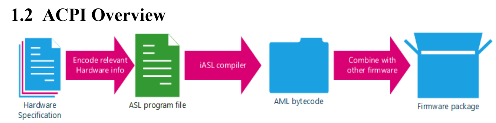
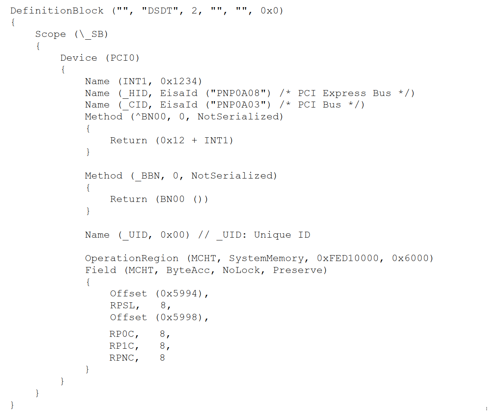
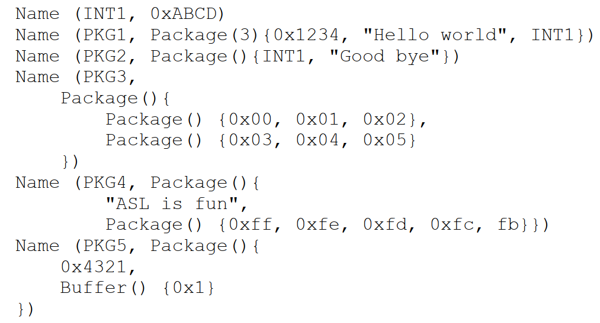
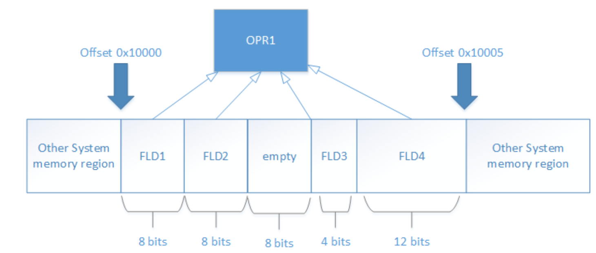

## Overview

ACPI(Advanced Configuration and Power Interface)是系统firmware(BIOS)和OS的中间接口，其目的是通过封装标准的ACPI框架和硬件寄存器集合设置独立供电及配置的框架。

OS负责配置和管理系统硬件资源，包括定时器、可移除设备等，因此需要OS能够正确地查找并配置这些设备。
有些设备有硬件框架，操作系统可以很容易地发现并配置。有些设备不能本地遍历，他们的配置依赖于特定的平台或主板，因此需要把这些设备平台相关的信息编码到ACPI中，使得OS能够遍历他们。


系统启动之后，AML interpreter从AML表(DSDT, SSDT)中构造ACPI namespace。ACPI namespace是树状的数据结构，映射了varaible name和internal objects。在操作系统请求查询AML interpreter时，interpreter会搜索ACPI namespace，并把internal object计算后的值返回。
ACPI namespace由AML interpreter拥有，并驻留在kernel space中。OS通过AML iterpreter加载firmware table，并查询计算variable对应的object。

ACPI namespace中的internal object包含用于配置和power管理的数据、设备层级和子例程(subroutine)，这些object计算(evaluate)之后可能会改变AML interpreter拥有的硬件寄存器。


包含 **_HID(Hardware Identification object)** 成员对象的device通常可以被ACPI遍历，并由ACPI加载他们的driver；包含 **_ADR(physical address object)** 成员的device通常不能被ACPI遍历，_ADR设备不通过ACPI就可以完成一些必要的功能，但是也可以通过ACPI完成需要的操作。

ACPI tables, handlers, interpreter, namespace, events和interrupt model共同实现了ACPI，并创建了OS中的ACPI subsystem。

ACPI namespace是可遍历的、多层表示的ACPI设备，它可用于发现和加载ACPI设备的driver。ACPI namespace可以实时地、动态地发送interrupt或计算ACPI objects。


## ACPI初始化流程

系统Firmware完成setup, initilization, 和self test之后，在把控制权交给Bootstrap之前，Firmware将会更新特定平台需要的ACPI表和power接口数据。

1. 使用XSDT表，该表之前FADT表。
2. OS初始化时，FADT表指向DSDT表，ACPI使用DSDT表构造ACPI namespace
3. OS构造完APCI namespace之后，遍历包含`_HID`的设备，加载这些设备的driver


# ACPI Source Language (ASL)

ASL是描述ACPI的编程语言。ASL编程的基本流程如下图所示。
1. 由Hardware Spec编码ASL file
2. 通过iASL compiler编译为AML bytecode
3. 由AML bytecode合并到其他Firmware中
4. 由ACPI Interpreter解析AML bytecode，并执行
 


## A example

```bash
$ sudo apt install acpica-tools
# save the following example to file: dsdt.asl
$ iasl dsdt.asl # will generate file dsdt.aml
$ acpiexec dsdt.aml # will run an interactive console
# In acpiexec interactive console
$$ n # list current variable name
$$ evaluate INT1 # will output integer: 0x1234
$$ q # exit
```



## ASL DefinitionBlock

```c
DefinitionBlock (AMLFileName, TableSignature, ComplianceRevision,
OEMID, TableID, OEMRevision)
{
    TermList // A list of ASL terms
}
```
- AMLFileName：AML文件名
- TableSignature: 4个字符长的string，"DSDT" or "SSDT"
- ComplianceRevision: 配置Integer为32位或64位，<=1是为32位，>=2时为64位
- OEMID: 6字符长的string；Original Equipment Manufacturer(OEM)的ACPI ID
- TableID: 8字符长的string；Table id
- OEMRevision: 32-bit的number；由OEM设置的版本号

## ACPI Variable

ACPI Namespace对应于ASL DefinitionBlock。ACPI Namespace中的variable name是4个字符长的string，如果定义中没有4个字符，则由compiler自动补全'\_'生成4个字符，variable name以字符或'\_'开始，其后包含其他的符号、数字或'\_'。

## ACPI Types

ACPI自定义了多种Variable Type，包含:
- Integer: 64-bit或32-bit的integer，由DefinitionBlock的ComplianceRevision控制具体size
- String: null-terminated ASCII string
- Buffer: array of bytes, byte的数值范围在[0x00, 0xff]
- Package: array of **ASL objects**，类似于python中的dict
- Object Reference: 类似于指针，由*RefOf*, *Index*, *ConRefOf*创建的reference
- Method: 可执行的AML函数



## ACPI Operation Regions and Fields

Operation Region是指一段特定类型的地址区域，定义了起始地址和区域长度。Region的类型包括SystemMemory, SystemIO, PCIConfig等。

例如，下述实例定义了SystemMemory类型的区域OPR1, 起始地址位0x10000,大小为0x5 bytes。包含4个区域: FLD1, FLD2, FLD3, FLD4。FLD1大小为8bits，FLD3大小为4bits，FLD2和FLD3之间有4bits的空余。

```c
DefinitionBlock ("", "DSDT", 2, "", "", 0x1)
{
    OperationRegion(OPR1, SystemMemory, 0x10000, 0x5)
    Field (OPR1)
    {
        FLD1, 8
        FLD2, 8
        Offset (3), //Start the next field unit at byte offset 3
        FLD3, 4
        FLD4, 12
    }
}
```


## ACPI Scope

通过`Device`定义新的Scope，例如下述示例定义了USBH scope，在USBH scope中包含USB1和USB2两个子scope。

```c
DefinitionBlock ("", "DSDT", 2, "", "", 0x1)
{
    Name (OBJ0, 0xffff)
    Name (OBJ1, "Dummy USB example")
    // USB host controller
    // This device can contain many ports
    Device (USBH)
    {
        Device (USB1) // USB port #1
        {
            Name (INT1, 0x1234)
            Name (STR1, "USB port 1")
            Name (BUF1, Buffer() {0x00, 0x04, 0x6f})
            Name (PKG1, Package() {OBJ0, OBJ1})
        }
        Device (USB2) // USB port #2
        {
            Name (INT1, 0xABCD)
            Name (STR1, "USB port 2")
            Name (BUF1, Buffer() {0x01, 0x05, 0x70})
            Name (PKG1, Package() {OBJ0, OBJ1})
        }
    }
}
```

通过name path索引具体的变量，主索引为'\'。通过'\USBH.USB2.INT1'可以获取USB2中INT1的值。

## Predefined Name

ACPI中预定义了一些Variable Name，OS会搜索ACPI namespace中的这些变量，并通过这些变量初始化设备。
例如，`_HID`标识设备的hardware ID；`_CRS`表示当前资源settting，它是一个buffer。

## Executable ASL


```c
Method (MethodName, NumArgs, SerializeRule)
{
    TermList // A list of ASL terms and expressions
}
```

- MethodName: Name of control method object
- NumArgs: Arguments个数，最多7个，分别是arg0-arg6
- SerializeRule: 是否可以被多线程调用这个Method
  
### 基本操作符

- 数值操作: +, -, *, /, %, +=, -=, *=, /=, %=, ++, --
- 位操作: <<, <<=, >>, >>=, |, |=, &, &=, ^, ^=, ~, ~=
- 逻辑操作: &&, ||, !, >, >=, <, >=

### 控制流操作

- if
- else
- while

### String操作

- printf()
- Concatenate()
- ToUUID()

### Buffer操作

Buffer变量中的元素可以通过\[\]进行索引，但是\[\]返回的索引是指针，需要使用Derefof解索引。
例如: `Derefof(arg0[local1])`。


### Bit fields

### Resource Templates

