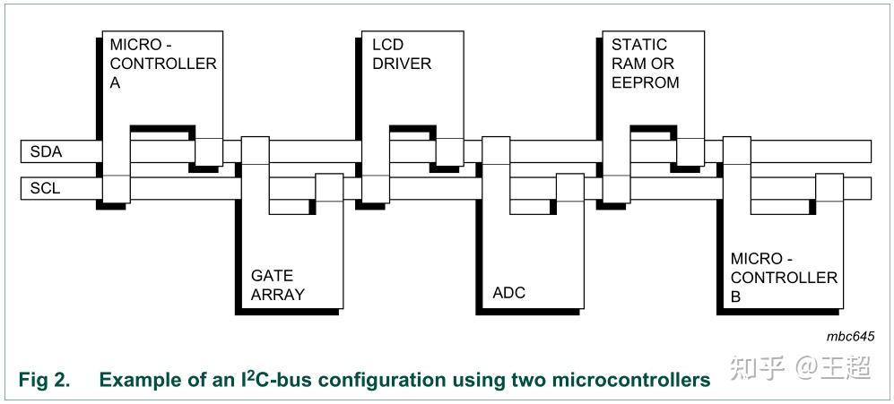
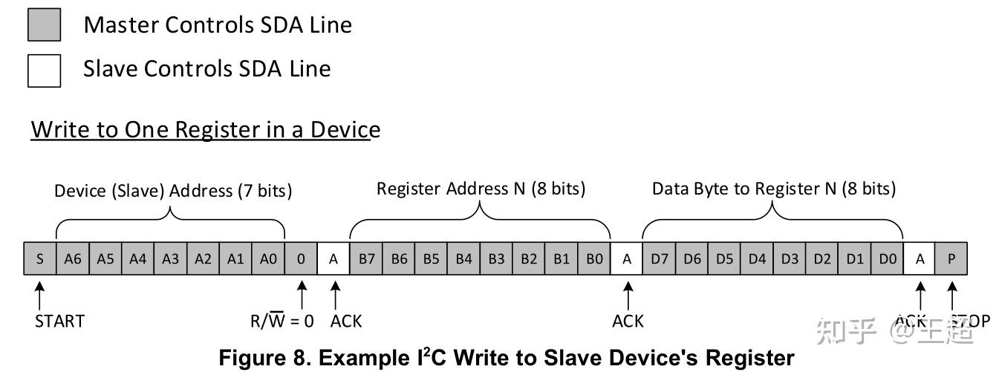
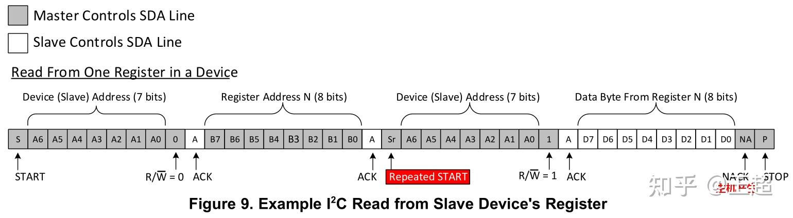
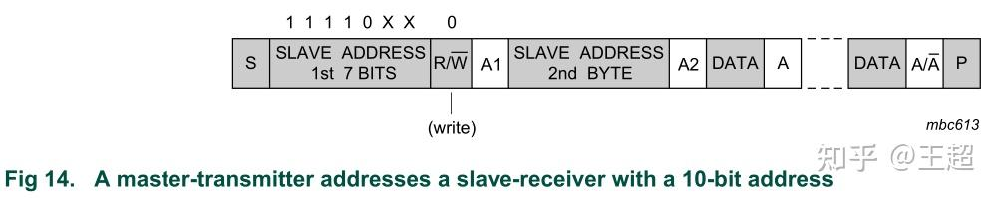
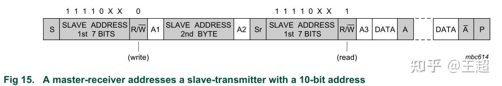
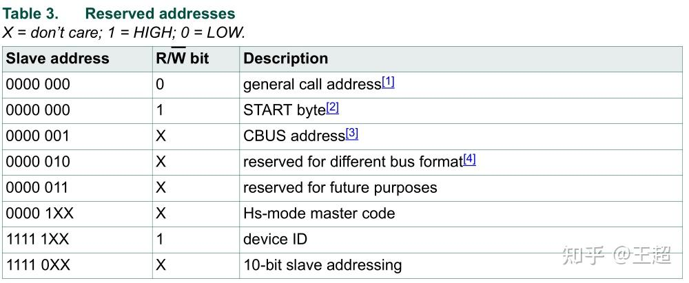

# I2C

1. I2C是一种简单的双向两线制总线协议，最少只需要两根线，支持多个slave设备。

2. 一个I2C理论上最多可挂载127个slave设备，去除保留地址后，最多可挂载112个设备。

3. I2C通过在读/写设备之前，在SDA总线上发送设备地址，片选指定的slave设备。

4. 与SPI不同的是，I2C支持multi-master系统，允许多个master与其他的slave设备通信。但同一时刻，master只能轮流使用I2C总线，且master之间不能通过I2C通信。

5. I2C包含数据应答机制，每发送8个bits，slave/master设备都要回复1bit的应答位(ACK或NACK)。

6. I2C是半双工通信的方式，由于只有一个数据线，在同一时刻只能有一个设备发送，另一个设备接收数据。

### I2C连接图

### I2C四种信号

I2C规定，只有在SCL为高电平时，SDA的数据才有效，才能采样SDA的数据。

1. 起始信号：SCL高电平，SDA由高变低
2. 终止信号：SCL高电平，SDA由低变高
3. 应答信号：在发送完1个字节后，从机需要发送1个bit表示确认是否成功收到了数据。主机释放SDA总线，从机将SDA拉低表示应答信息。
4. 非应答信号：在应答期间，从机将SDA拉高表示非应答。

### 读写时序
1. 向指定寄存器写数据

---
2. 从指定寄存器读数据

### 地址

#### 7位和10位地址

1. 目前大多采用7位地址

2. 10位地址通过发送两次，进而拼接地址来完成

#### 地址保留字节
I2C在发送第一个地址的控制信息时，除了厂商指定的设备地址，还有一些保留字节，主要有两组[0000 XXX]和[1111 XXX]。分别是：

#### I2C IOCTL的使用

[https://stackoverflow.com/questions/9974592/i2c-slave-ioctl-purpose](https://stackoverflow.com/questions/9974592/i2c-slave-ioctl-purpos)