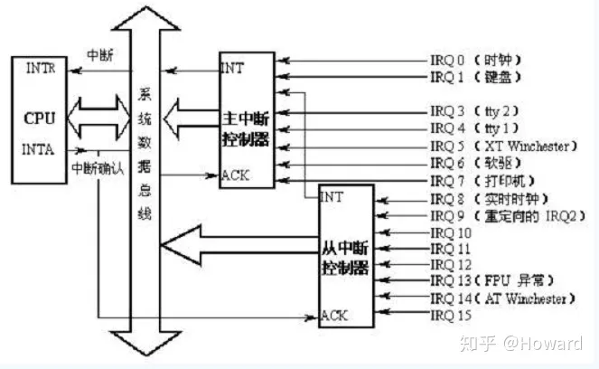
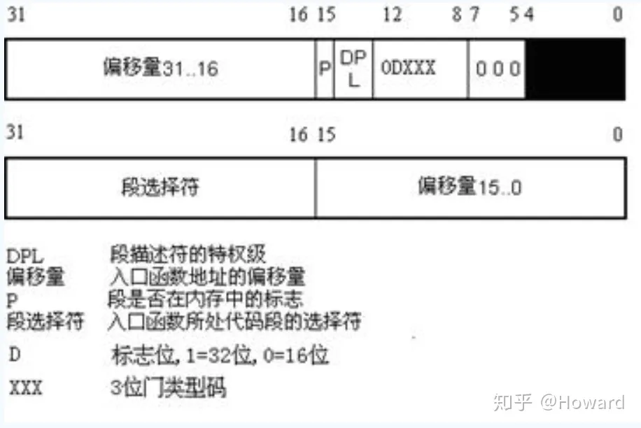

# Some Interrupt API


There are some method to close interrupt.

1. at the device level
program the device control registers to close interrupt of the device.
&nbsp;

2. at the PIC level
PIC can be programed to disable a given IRQ line.

```c
disable_irq(unsigned int irq);
enable_irq(unsigned int irq);
```

3. at the CPU level.
* `cli`: clear the interrupt flag
* `sti`: set interrupt flag

```c
// disable irq on current processor, it wraps `cli`
local_irq_save(unsigned int flag);
local_irq_restore(unsigned int flag);

local_irq_disable();
local_irq_enable();


// disable softirqs bottom half process
//   Softirqs are processed on either, interrupt return path,
//   or by the ksoftirqd-(per cpu)-thread that will be woken up
//   if the system suffers of heavy softirq-load. 
local_bh_disable();
local_bh_enable();
// We can call local_bh_disable multiple timer to disable bottom-softirq,
// and we should also call local_bh_enable the same times to enable it.


// disable preemption
// it means a thread that executes in <preempt_diable>--<preempt_enable> scope
// will not be put to sleep by the scheduler.
preempt_disable();
preempt_enable();

```

# 中断号及中断向量

中断号是一个很模糊的概念，在早期的8259A芯片上，每个引脚关联一个中断号，称之为INT0-INT7，然而在现阶段Linux中，INT0-INT7放置到了中断向量表的32-39号的位置，感觉也可以将中断向量32成为32中断号。



---

对于中断向量的概念比较清晰，中断向量是为每个中断所关联的共4B的数据结构。0-31个中断向量是cpu异常和非屏蔽中断；32-127由外部硬件触发：

* 0~31：处理cpu异常和非屏蔽中断，它实际上被Intel保留，操作系统不可使用。
* 32~127：由外部硬件触发，它又分为可屏蔽中断(INTR)和非可屏蔽中断(NMI)。
* 128：linux用于系统，当执行int 0x80时，就会陷入内核态执行system_call。
对于硬件中断来说，中断向量号 = IRQ + 32，因为前31个是cpu异常。IRQ0对应的中断向量号是32（0x20）。



# Deferred Work

The main types of deferred work are kernel threads and softirqs. Work queues are implemented on top of kernel threads and tasklets and timers on top of softirqs.

# Tasklet

***If a tasklet was scheduled multiple times and it did not run between schedules, it will run once.***


```c
void handler(unsigned long data);

DECLARE_TASKLET(tasklet, handler, data);
DECLARE_TASKLET_DISABLED(tasklet, handler, data);

struct tasklet_struct tasklet;
tasklet_init(&tasklet);

void tasklet_schedule(struct tasklet_struct *tasklet);
void tasklet_hi_schedule(struct tasklet_struct *tasklet);

void tasklet_enable(struct tasklet_struct *tasklet);
void tasklet_disable(struct tasklet_struct *tasklet);
```

# Timer

```c
#include <linux/sched.h>

void timer_setup(struct timer_list *timer,
                void (*func)(struct timer_list *timer),
                unsigned int flags
            );

int mod_timer(struct timer_list *timer, unsigned long expires);

int del_timer(struct timer_list *timer);
int del_timer_sync(struct timer_list *timer);
```
**For del_timer_sync(), at the end of the call it is guaranteed that the timer processing function does not run on any processor.**

# Workqueue

* `struct work_struct`- it schedules a task to run at a later time.
* `struct delayed_work`- it schedules a task to run after at least a given interval.

```c
#include <linux/workqueue.h>

// Declare & Init
DECLARE_WORK(name, void (*func)(struct work_struct *));
DECLARE_DELAYED_WORK(name, void (*func)(struct work_struct *));

// Init
struct work_struct *work;
INIT_WORK(struct work_struct *, void (*func)(struct work_struct *));
INIT_DELAYED_WORK(struct delayed_work *, void(*func)(struct work_struct *));

// schedule
schedule_work(struct work_struct *work);
schedule_delayed_work(struct delayed_work *work, unsigned long delay); // delay is jiffies (seconds*HZ)
// When the functions return, it's guaranteed the task will no longer run
// If some works in run when call the work, the work will still run to the end.

// cancel
cancel_work_sync(struct work_struct *work);
cancel_delayed_work_sync(struct delayed_work *work);
// sync version

// finish
void finish_scheduled_work(void);
// this will block utill all work items complete

// schedule
void schedule_delayed_work_on(int cpu, struct delayed_work *work, unsigned long delay);
// schedule on a specific cpu
void schedule_on_each_cpu(struct work_struct *);
// schedule on every cpu

```

## workqueue_struct

By default, the `struct work_struct` items are putted in the kernel `kworker/event-x` thread, we can create a new workqueue/thread and put the `struct work_struct` on the new queue.

```c
// create
struct workqueue_struct *create_workqueue(const char *name);
// use on thread for each processor
struct workqueue_struct *create_singlethread_workqueue(const char *name);
// use a single thread


// put work to queue
int queue_work(struct workqueue_struct *queue, struct work_struct *work);
int queue_delayed_work(struct workqueue_struct *queue, struct delayed_work *work, unsigned long delay);


// flush
void flush_workqueue(struct workqueue_struct *queue);

void destroy_workqueue(struct workqueue_struct *queue);
```

## kernel threads

Kernel threads are the basis of the workqueue machanism. A kernel thread is a thread that only runs in kernel mode and has no user address space or other user attributes.

```c
#include <linux/kthread.h>

// create
struct task_struct *kthread_create(int (*threadfn)(void *data), void *data, const char fmt[], ...);
// after creating the kthread, it will be stopped in `TASK_INTERRUPTIBLE` state.

// start
#include <linux/sched.h>
int wake_up_process(struct task_struct *p);

// create & run
struct task_struct *kthread_run(int (*threadfn)(void *data), void *data, const char fmt[], ...);

// exit
fastcall NORET_TYPE void do_exit(long code);
```

**Example**:
```c
#include <linux/kthread.h>

DECLARE_WAIT_QUEUE_HEAD(wq);

// list events to be processed by kernel thread
struct list_head events_list;
struct spin_lock events_lock;


// structure describing the event to be processed
struct event {
    struct list_head lh;
    bool stop;
    //...
};

struct event* get_next_event(void)
{
    struct event *e;

    spin_lock(&events_lock);
    e = list_first_entry(&events_list, struct event*, lh);
    if (e)
        list_del(&e->lh);
    spin_unlock(&events_lock);

    return e
}

int my_thread_f(void *data)
{
    struct event *e;

    while (true) {
        wait_event(wq, (e = get_next_event));

        /* Event processing */

        if (e->stop)
            break;
    }

    do_exit(0);
}

/* start and start kthread */
kthread_run(my_thread_f, NULL, "%skthread%d", "my", 0);


void send_event(struct event *ev)
{
    spin_lock(&events_lock);
    list_add(&ev->lh, &events_list);
    spin_unlock(&events_lock);
    wake_up(&wq);
}
```

