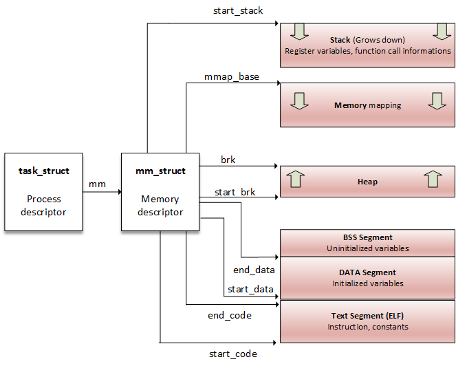
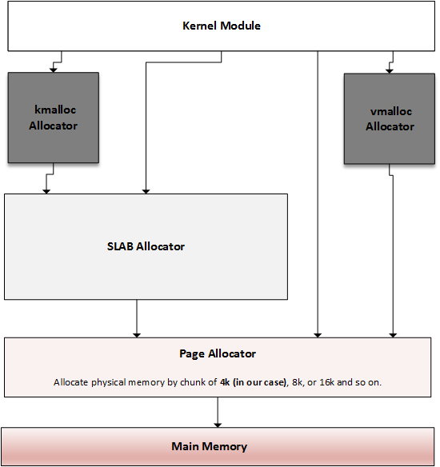
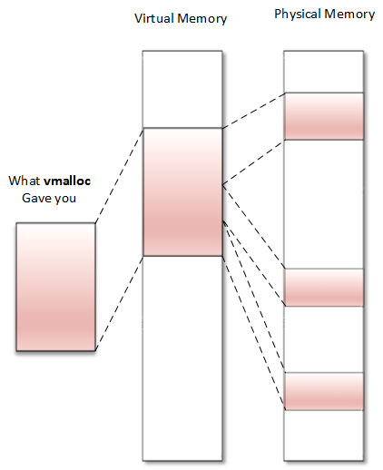

# 1. Introduction

For 32-bit system, 4GB memory space in total. 0-3GB is user space. 3-4GB is kernel space.

Kernel space can be split into Low memory(896MB) and High memory(128MB).

For Low memory, 896MB virtual address is mapped into 0-896MB of physical address. It's permanently mapped. It can be split into 2 parts:

* ZONE_DMA: 0-16MB, reserve for DMA.
* ZONE_NORMAL: 16-896MB, for normal use.

For High memory, it's used to temporarily map physical memory above 1GB. In this way, the kernal can access memory larger than 1GB.

For 64-bit system, no High memory is needed.

# 2. User space address

`mm_struct` for a processor.


`vm_area_struct`


```bash
# cat /proc/1073/maps
00400000-00403000 r-xp 00000000 b3:04 6438 /usr/sbin/net-listener
00602000-00603000 rw-p 00002000 b3:04 6438 /usr/sbin/net-listener
00603000-00624000 rw-p 00000000 00:00 0 [heap]
7f0eebe4d000-7f0eebe54000 r-xp 00000000 b3:04 11717 /usr/lib/libffi.so.6.0.4
7f0eebe54000-7f0eec054000 ---p 00007000 b3:04 11717 /usr/lib/libffi.so.6.0.4
7f0eec054000-7f0eec055000 rw-p 00007000 b3:04 11717 /usr/lib/libffi.so.6.0.4
7f0eec055000-7f0eec069000 r-xp 00000000 b3:04 21629 /lib/libresolv-2.22.so
7f0eec069000-7f0eec268000 ---p 00014000 b3:04 21629 /lib/libresolv-2.22.so
[...]
7f0eee1e7000-7f0eee1e8000 rw-s 00000000 00:12 12532 /dev/shm/sem.thk-mcp-231016-sema
[...]
```

Each page allocated to a process belongs to an area; thus, any page that does not live in the VMA does not exist and cannot be referenced by the process.


`struct page` is the representation about physical memory, `struct vma_area_struct` is the representation about virtual memory.

# 3. Memory allocation mechanism

All sorts of allocators


## 3.1. Page Allocator

The page allocator is the lowest level allocator on the Linux system, the one on which other allocators rely.

The system's physical memory is made up of fixed-size blocks (called page frames). A page frame is represented in the kernel as an instance of the struct page structure. A `page` is the smallest unit of memory that the OS will give to any memory request at a low level.


#### 3.1.0.1. **return `struct page`**

$n=order$, allocate $2^n$ pages.

```c
struct page *alloc_pages(gfp_t mask, unsigned int order) 
#define alloc_page(gfp_mask) alloc_pages(gfp_mask, 0) 

void __free_pages(struct page *page, unsigned int order); 
```

#### 3.1.0.2. **return page address**

should not allocate `GFP_HIGHMEM` with this method. Since `HIGHMEM` memory is not guaranteed to be contiguous, you can't return an address for memory allocated from that zone.

```c
unsigned long __get_free_pages(gfp_t mask, unsigned int order); 
unsigned long get_zeroed_page(gfp_t mask); 

free_pages(unsigned long addr, unsigned int order); 
```

* `GFP_USER`: For user memory allocation.
* `GFP_KERNEL`: The commonly used flag for kernel allocation.
* `GFP_HIGHMEM`: Requests memory from the HIGH_MEM zone.
* `GFP_ATOMIC`: Allocates memory in an atomic manner that cannot sleep. Used when you need to allocate memory from an interrupt context.

***The maximum number of pages you can allocate is 1,024. It means that on a 4 KB sized system, you can allocate up to 1,024\*4 KB = 4 MB at most. It is the same for kmalloc\.***

### 3.1.1. `struct page` <==> virtual address

The `page_to_virt()` function is used to convert the `struct page` into the kernel address. `virt_to_page()` takes a kernel virtual address and returns its associated `struct page` instance
```c
struct page *virt_to_page(void *kaddr); 
void *page_to_virt(struct page *pg);
```

The `page_address()` macro can be used to return the virtual address that corresponds to the beginning address (the logical address of course) of a struct page instance:
```c
void *page_address(const struct page *page);
```


## 3.2. Slab Allocator

The slab allocator is the one on which `kmalloc()` relies.

It eliminates the fragmentation caused by memory (de)allocation that would be caused by the buddy system in the case of small-size memory allocation, and speed up memory allocation for commonly used objects.

#### 3.2.0.1. The buddy algorithm

To allocate memory, the requested size is rounded up to a power of two, and the buddy allocator searches the appropriate list. If no entries exist on the requested list, an entry from the next upper list (which has blocks of twice the size of the previous list) is split into two halves (called buddies). The allocator uses the first half, while the other is added to the next list down. 

#### 3.2.0.2. The slab allocator

* **Slab**: This is a contiguous piece of physical memory made of several page frames. Each slab is divided into equal chunks of the same size, used to store specific types of kernel object, such as inodes, mutexes, and so on. Each slab is then an array of objects.

* **Cache**: It is made of one or more slabs in a linked list, and they are represented in the kernel as instances of the struct kmem_cache_t structure. The cache only stores objects of the same type (for example, inodes only, or only address space structures).


## 3.3. kmalloc allocation


***Memory returned by `kmalloc` is contiguous in physical memory and in virtual memory.***

Memory returned from kmalloc has a kernel logical address because it is allocated from the `LOW_MEM` region, unless `HIGH_MEM` is specified. It relies on the SLAB allocator.

```c
void *kmalloc(size_t size, int flags); 
void kfree(const void *ptr);

void kzalloc(size_t size, gfp_t flags); 
void kzfree(const void *p); 

void *kcalloc(size_t n, size_t size, gfp_t flags); 
void *krealloc(const void *p, size_t new_size, gfp_t flags); 
```

* `GFP_KERNEL`: the standard flag.
* `GFP_ATOMIC`: only used in interrupt context.
It is done basically instructing the kernel to get the memory chunks from the pre-allocated slab memory if there is memory in the slab then it is allocated atomically else allocation fails.
https://stackoverflow.com/questions/13936795/how-does-gfp-atomic-prevent-sleep.

* `GFP_USER`: allocates memory to a user space process.
* `GFP_HIGHUSER`: allocate from `HIGH_MEMORY` zone.
* `GFP_DMA`: allocate memory for DMA.


## 3.4. vmalloc



***`vmalloc` returns memory only contiguous in virtual space (not physically contiguous).***

The returned memory always comes from the `HIGH_MEM` zone.

It is correct to use vmalloc() to allocate memory for a large sequential that exists only in software, for example, in a network buffer.

`vmalloc()` is slower than `kmalloc()` or page allocator functions, because it must retrieve the memory, build the page tables, or even remap into a virtually contiguous range, whereas `kmalloc()` never does that.

# 4. Working with IO

## 4.1. Port Input Output

```c
struct resource *request_region(unsigned long start, unsigned long len, char *name); 
void release_region(unsigned long start, unsigned long len); 

u8 inb(unsigned long addr);
u16 inw(unsigned long addr);
u32 inl(unsigned long addr);

void outb(u8 b, unsigned long addr);
void outw(u16 b, unsigned long addr);
void outl(u32 b, unsigned long addr); 
```

## 4.2. MMIO device access

The kernel uses part of the address space normally used by RAM (`HIGH_MEM` actually) to map the device registers.

```c
struct resource* request_mem_region(unsigned long start, unsigned long len, char *name);
void release_mem_region(unsigned long start, unsigned long len) 

void __iomem *ioremap(unsigned long phys_add, unsigned long size);
void iounmap(void __iomem *addr);

unsigned int ioread8(void __iomem *addr);
unsigned int ioread16(void __iomem *addr);
unsigned int ioread32(void __iomem *addr);
void iowrite8(u8 value, void __iomem *addr);
void iowrite16(u16 value, void __iomem *addr);
void iowrite32(u32 value, void __iomem *addr);
```

# 5. Memory (re)mapping

## 5.1. ***The difference with `kmap` and `page_address`:***

For a non-highmem page, kmap delegates to page_address.
https://unix.stackexchange.com/questions/703449/whats-the-difference-between-kmap-and-page-address-in-x64-system


## 5.2. kmap: mapping page to virtual address

The Linux kernel permanently maps 896 MB of its address space to the lower 896 MB of the physical memory (low memory).
On a 4 GB system, there is only 128 MB left to the kernel to map the remaining 3.2 GB of physical memory (high memory).

When it comes to high memory (memory above 896 MB), the kernel has to map the requested region of high memory into its address space, and the 128 MB mentioned before is especially reserved for this.

128 MB is not enough to map 3.2 GB. The best programming practice is to unmap high memory mappings when no longer required.

```c
void *kmap(struct page *page); 
void kunmap(struct page *page); 
```

This function works on both high memory and low memory.
```c
void *kmap(struct page *page) 
{ 
   BUG_ON(in_interrupt()); 
   if (!PageHighMem(page)) 
         return page_address(page); 
 
   return kmap_high(page); 
}
```

## 5.3. mapping kernel memory to user space

### 5.3.1. mapping physical memory to user space: `remap_pfn_range`


`remap_pfn_range()` maps physical memory to a user space process.

Operations of `remap_pfn_range()`:

* The kernel PTE of the mapped region will be derived and given to the process, with different protection flags.
* The process's VMA list is updated with a new VMA entry (with appropriate attributes) , which will use PTE to access the same memory.

```c
int remap_pfn_range(struct vm_area_struct *vma, unsigned long addr,
            unsigned long pfn, unsigned long size, pgprot_t flags); 
```

* `pgprot_t flags`: the protection requested for the VMA. The driver can mangle the default value, but should mangle with OR of the value in `vma->vm_page_prot`.
      * `VM_IO`: specifies a device's memory mapped I/O 
      * `VM_DONTCOPY`: tells the kernel not to copy this `vma` on fork
      * `VM_DONTEXPAND`: prevents `vma` from expanding with `mremap(2)`
      * `VM_DONTDUMP`: prevents the `vma` from being included in the core dump

See details at https://learning.oreilly.com/library/view/linux-device-drivers/9781785280009/cd93dea5-bdbc-4864-af06-d7cff4d35c27.xhtml.


### 5.3.2. mapping I/O device memory to user space: `io_remap_page_range`

```c
int io_remap_page_range(struct vm_area_struct *vma, 
                        unsigned long virt_addr, 
                        unsigned long phys_addr, 
                        unsigned long size, pgprot_t prot); 
```

There is no need to use `ioremap()` when attempting to map I/O memory to user space. `ioremap()` is intended for kernel purposes (mapping I/O memory into the kernel address space), whereas `io_remap_pfn_range` is for user space purposes.

Just pass your real physical I/O address directly to `io_remap_pfn_range()`.

### 5.3.3. `mmap` file operation

The kernel `mmap` function is part of the `struct file_operations` structure, which is executed when the user executes the `mmap(2)` system call used to map physical memory into a user virtual address.

```c
int (*mmap) (struct file *filp, struct vm_area_struct *vma); 
```

* `filp`: a pointer to the open device file for the driver that results from the translation of the fd parameter.
* `vma`: **is allocated and given as a parameter by the kernel**, a pointer to the user process's vma where the mapping should go.

#### 5.3.3.1. mmap system call:

***mmap syscall usage example***: https://linuxhint.com/using_mmap_function_linux/

```c
void *mmap(void *addr, size_t length, int prot, int flags, int fd, off_t offset); 
```

* `addr`: the user space's virtual address where the mapping should start. It has an impact on `vma->vm_start`. If `NULL` (the most portable way) is specified, automatically determines the correct address.
* `length`: specifies the length of the mapping, and indirectly has an impact on `vma->vm_end`. The size of a `vma` is always a multiple of `PAGE_SIZE`.
* `prot`: affects the permissions of the VMA, which the driver can find in `vma->vm_pro`. the driver can update these values, but not alter them.

      PROT_READ | PROT_WRITE | PROT_EXEC | PROT_NONE

* `flags`: determines the type of mapping that the driver can find in `vma->vm_flags`. The mapping can be private or shared.

      MAP_SHARED | MAP_PRIVATE | MAP_ANONYMOUS/MAP_ANON | MAP_FIXED

* `offset`: the offset within the mapped region, thus mangling the value of vma->vm_pgoff.


### 5.3.4. Implementing mmap in the kernel

```c
int my_mmap(struct file *filp, struct vm_area_struct *vma) {
      unsigned long offset = vma->vm_pgoff << PAGE_SHIFT;  
      if (offset >= buffer_size) 
            return -EINVAL; 

      unsigned long size = vma->vm_end - vma->vm_start; 
      if (size > (buffer_size - offset)) 
            return -EINVAL; 

      unsigned long pfn; 
      /* we can use page_to_pfn on the struct page structure 
      * returned by virt_to_page 
      */ 
      /* pfn = page_to_pfn (virt_to_page (buffer + offset)); */ 
      
      /* Or make PAGE_SHIFT bits right-shift on the physical 
      * address returned by virt_to_phys 
      */       
      pfn = virt_to_phys(buffer + offset) >> PAGE_SHIFT; 

      // Disable caching using
      vma->vm_page_prot = pgprot_noncached(vma->vm_page_prot)
      // Set the VM_IO flag
      vma->vm_flags |= VM_IO
      // Prevent the VMA from swapping out
      vma->vm_flags |= VM_DONTEXPAND | VM_DONTDUMP

      if (remap_pfn_range(vma, vma->vm_start, pfn, size, vma->vm_page_prot)) { 
            return -EAGAIN; 
      } 
      return 0;
}

static const struct file_operations my_fops = { 
   .owner = THIS_MODULE, 
   [...] 
   .mmap = my_mmap, 
   [...] 
}; 
```

# Device-managed resources

Devres is a kernel facility helping the developer by automatically freeing the allocated resource in a driver. It simplifies errors handling in `init/probe/open` functions.

Devres consists of a linked list of arbitrarity sized memory areas associated with a `struct device`. Each devres resource allocator inserts the allocated resource in the list.

The resource remains availiable until it is manually freed by the code, when the device is detached from the system, or when the driver is unloaded.

The list of resources availiable for a driver:
* Memory for private data structures
* Interrupts(IRQs)
* Memory region allocation
  * `request_mem_region`
* I/O mapping of memory regions
  * `ioremap`
* Buffer memory (possibly with DMA mapping)
* Different framework data structures: clocks, GPIOs, PWMs, USB phy, regulators, DMA, and so on

Detailed list: https://docs.kernel.org/driver-api/driver-model/devres.html#list-of-managed-interfaces
