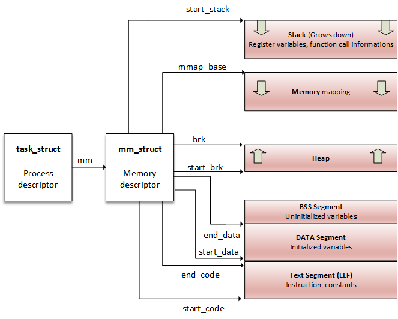
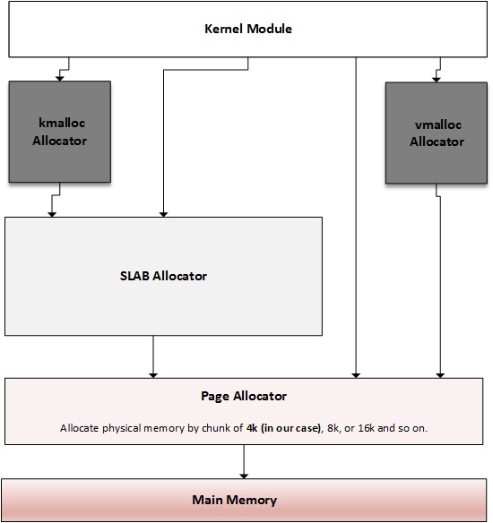
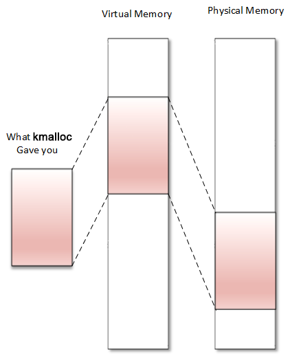
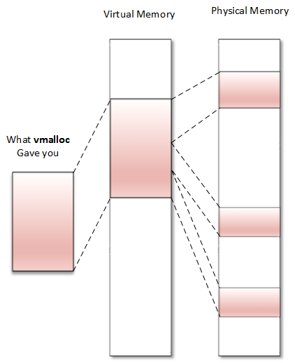

# Introduction

For 32-bit system, 4GB memory space in total. 0-3GB is user space. 3-4GB is kernel space.

Kernel space can be split into Low memory(896MB) and High memory(128MB).

For Low memory, 896MB virtual address is mapped into 0-896MB of physical address. It's permanently mapped. It can be split into 2 parts:

* ZONE_DMA: 0-16MB, reserve for DMA.
* ZONE_NORMAL: 16-896MB, for normal use.

For High memory, it's used to temporarily map physical memory above 1GB. In this way, the kernal can access memory larger than 1GB.

For 64-bit system, no High memory is needed.

# User space address

`mm_struct` for a processor.


`vm_area_struct`


```bash
# cat /proc/1073/maps
00400000-00403000 r-xp 00000000 b3:04 6438 /usr/sbin/net-listener
00602000-00603000 rw-p 00002000 b3:04 6438 /usr/sbin/net-listener
00603000-00624000 rw-p 00000000 00:00 0 [heap]
7f0eebe4d000-7f0eebe54000 r-xp 00000000 b3:04 11717 /usr/lib/libffi.so.6.0.4
7f0eebe54000-7f0eec054000 ---p 00007000 b3:04 11717 /usr/lib/libffi.so.6.0.4
7f0eec054000-7f0eec055000 rw-p 00007000 b3:04 11717 /usr/lib/libffi.so.6.0.4
7f0eec055000-7f0eec069000 r-xp 00000000 b3:04 21629 /lib/libresolv-2.22.so
7f0eec069000-7f0eec268000 ---p 00014000 b3:04 21629 /lib/libresolv-2.22.so
[...]
7f0eee1e7000-7f0eee1e8000 rw-s 00000000 00:12 12532 /dev/shm/sem.thk-mcp-231016-sema
[...]
```

Each page allocated to a process belongs to an area; thus, any page that does not live in the VMA does not exist and cannot be referenced by the process.


`struct page` is the representation about physical memory, `struct vma_area_struct` is the representation about virtual memory.

# Memory allocation mechanism

All sorts of allocators


## Page Allocator

The page allocator is the lowest level allocator on the Linux system, the one on which other allocators rely.

The system's physical memory is made up of fixed-size blocks (called page frames). A page frame is represented in the kernel as an instance of the struct page structure. A `page` is the smallest unit of memory that the OS will give to any memory request at a low level.


#### **return `struct page`**

$n=order$, allocate $2^n$ pages.

```c
struct page *alloc_pages(gfp_t mask, unsigned int order) 
#define alloc_page(gfp_mask) alloc_pages(gfp_mask, 0) 

void __free_pages(struct page *page, unsigned int order); 
```

#### **return page address**

should not allocate `GFP_HIGHMEM` with this method.

```c
unsigned long __get_free_pages(gfp_t mask, unsigned int order); 
unsigned long get_zeroed_page(gfp_t mask); 

free_pages(unsigned long addr, unsigned int order); 
```

* `GFP_USER`: For user memory allocation.
* `GFP_KERNEL`: The commonly used flag for kernel allocation.
* `GFP_HIGHMEM`: Requests memory from the HIGH_MEM zone.
* `GFP_ATOMIC`: Allocates memory in an atomic manner that cannot sleep. Used when you need to allocate memory from an interrupt context.

***The maximum number of pages you can allocate is 1,024. It means that on a 4 KB sized system, you can allocate up to 1,024\*4 KB = 4 MB at most. It is the same for kmalloc\.***

### `struct page` <==> virtual address

```c
struct page *virt_to_page(void *kaddr); 
void *page_to_virt(struct page *pg);
```

## Slab Allocator

The slab allocator is the one on which `kmalloc()` relies.

It eliminates the fragmentation caused by memory (de)allocation that would be caused by the buddy system in the case of small-size memory allocation, and speed up memory allocation for commonly used objects.

#### The buddy algorithm

To allocate memory, the requested size is rounded up to a power of two, and the buddy allocator searches the appropriate list. If no entries exist on the requested list, an entry from the next upper list (which has blocks of twice the size of the previous list) is split into two halves (called buddies). The allocator uses the first half, while the other is added to the next list down. 

## kmalloc allocation



***Memory returned by `kmalloc` is contiguous in physical memory and in virtual memory.***

Memory returned from kmalloc has a kernel logical address because it is allocated from the `LOW_MEM` region, unless `HIGH_MEM` is specified. It relies on the SLAB allocator.

```c
void *kmalloc(size_t size, int flags); 
void kfree(const void *ptr);

void kzalloc(size_t size, gfp_t flags); 
void kzfree(const void *p); 

void *kcalloc(size_t n, size_t size, gfp_t flags); 
void *krealloc(const void *p, size_t new_size, gfp_t flags); 
```

* `GFP_KERNEL`: the standard flag.
* `GFP_ATOMIC`: only used in interrupt context.
It is done basically instructing the kernel to get the memory chunks from the pre-allocated slab memory if there is memory in the slab then it is allocated atomically else allocation fails.
https://stackoverflow.com/questions/13936795/how-does-gfp-atomic-prevent-sleep.

* `GFP_USER`: allocates memory to a user space process.
* `GFP_HIGHUSER`: allocate from `HIGH_MEMORY` zone.
* `GFP_DMA`: allocate memory for DMA.


## vmalloc



***`vmalloc` returns memory only contiguous in virtual space (not physically contiguous).***

The returned memory always comes from the `HIGH_MEM` zone.

It is correct to use vmalloc() to allocate memory for a large sequential that exists only in software, for example, in a network buffer.

`vmalloc()` is slower than `kmalloc()` or page allocator functions, because it must retrieve the memory, build the page tables, or even remap into a virtually contiguous range, whereas `kmalloc()` never does that.

# Working with IO

## Port Input Output

```c
struct resource *request_region(unsigned long start, unsigned long len, char *name); 
void release_region(unsigned long start, unsigned long len); 

u8 inb(unsigned long addr);
u16 inw(unsigned long addr);
u32 inl(unsigned long addr);

void outb(u8 b, unsigned long addr);
void outw(u16 b, unsigned long addr);
void outl(u32 b, unsigned long addr); 
```

