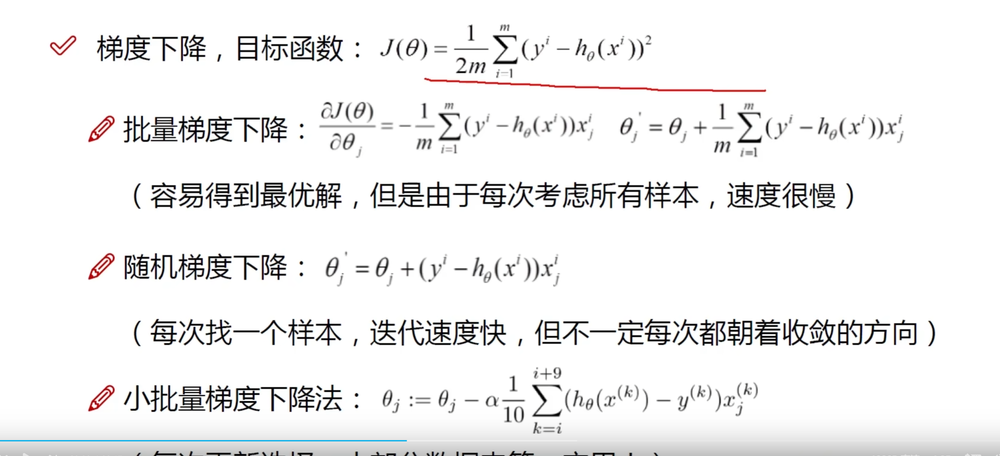

### From

[https://www.bilibili.com/video/BV1wL411X7GA?p=3&vd_source=5b2b9562341c1c168f7774af0cca44e4](https://www.bilibili.com/video/BV1wL411X7GA?p=3&vd_source=5b2b9562341c1c168f7774af0cca44e4)

#### 1. 回归问题的求解类似于:
$$
\sum^{n}_{i=1}{x_i\theta_i}=y_i \tag{1}
$$

$$
X\theta=y       \tag{2}
$$

函数形式为：
$$
h_\theta = \sum^{n}_{i=1}{x_i\theta_i} = \theta^{T}x
$$

#### 2. 附加误差的真实情况：
公式如下：
$$
y^i = \theta^{T}x^{i} + \epsilon^{i} \tag{3} 
$$

误差$\epsilon^{i}$服从均值为0，方差为$\theta^2$的高斯分布。每个变量$x^i$之间互相独立，误差$\epsilon^i$也互相独立，公式如下。
$$
p(\epsilon^i) = \frac{1}{\sqrt{2\pi}\sigma}\exp(-\frac{(\epsilon^i)^2}{2\sigma^2}) \tag{4}
$$

将公式3带入4后，得到：
$$
p(y^i|x^i; \theta) = \frac{1}{\sqrt{2\pi}\sigma}\exp(-\frac{(y^i - \theta^T x^i) ^2 }{2\sigma^2}) \tag{5}
$$

**考虑到要让似然函数(公式6)最小**，将其转为对数似然函数后得到公式7。
$$
L(\theta) = \prod^{n}_{i=1}\frac{1}{\sqrt{2\pi}\sigma}\exp(-\frac{(y^i - \theta^T x^i) ^2 }{2\sigma^2}) \tag{6}
$$

$$
\log{L(\theta)} = \log{\prod^{n}_{i=1}{} \frac{1}{\sqrt{2\pi}\sigma}\exp(-\frac{(y^i - \theta^T x^i) ^2 }{2\sigma^2})} \\
= m\log\frac{1}{\sqrt{2\pi}\sigma} - \frac{1}{\sigma^2}*\frac{1}{2}{\sum^{n}_{i=1}(y^i - \theta^T x^i)^2}  \tag{7}
$$

因此，为了使$L(\theta)$最小，需要公式8越大越好(最小二乘法)。
$$
J(\theta) = \frac{1}{2}{\sum^{n}_{i=1}(y^i - \theta^T x^i)^2}  \tag{8}
$$

&nbsp;

为了使公式8最小，对其求偏导使其结果为0。
$$
J(\theta) = \frac{1}{2}{\sum^{n}_{i=1}(h_\theta(x^i) - y_i)^2}  \tag{9} \\
= \frac{1}{2}(X\theta - y)^T (X\theta - y)
$$

$$
\partial_\theta J(\theta) = X^T X\theta - X^Ty \tag{10}
$$

**为了使偏导$\partial_\theta=0$，可以使**
$$
\theta=(X^T X)^{-1} X^Ty        \tag{11}
$$

在计算$\theta$时，使用梯度下降规则。

#### 3. 梯度下降

****