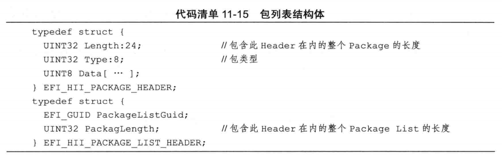
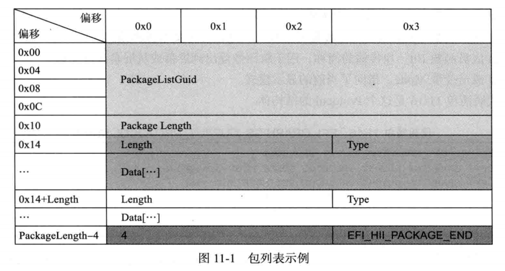
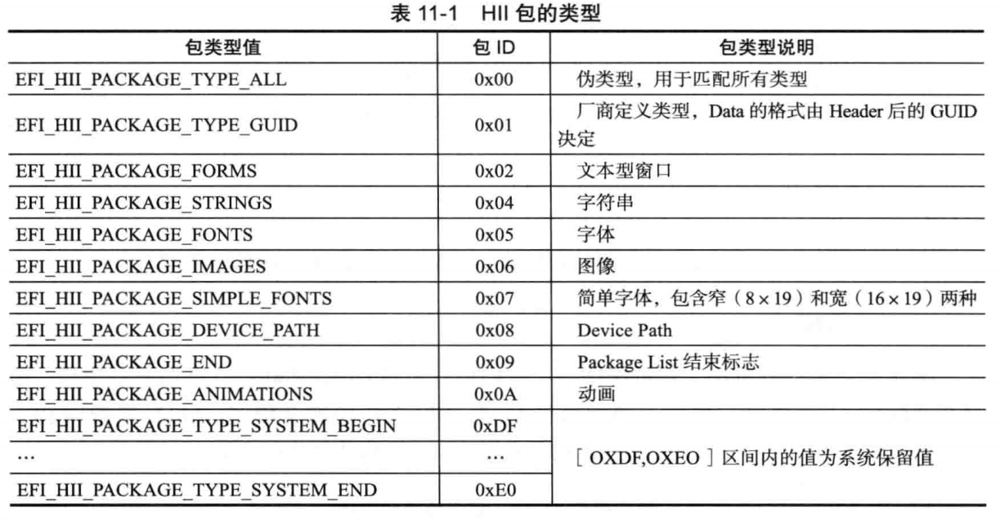
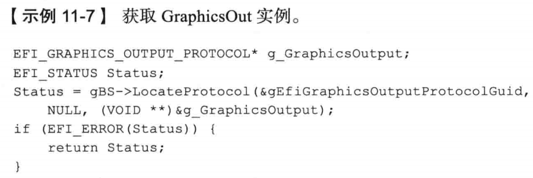
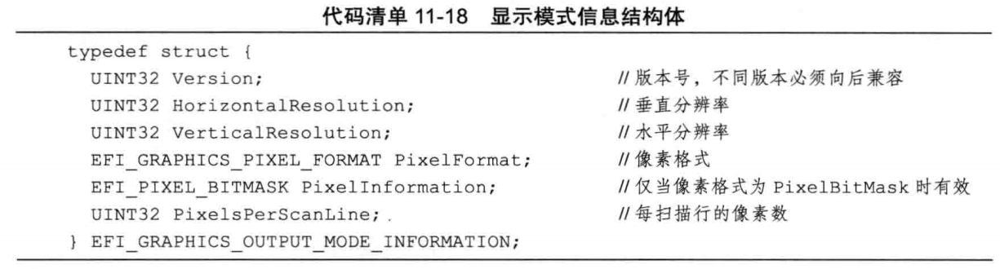
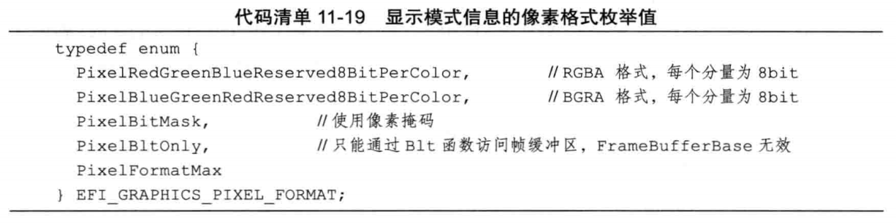
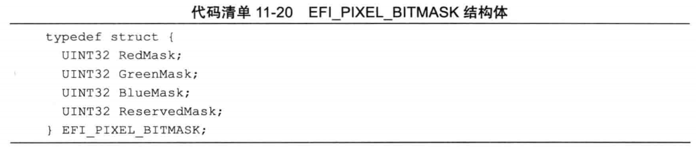
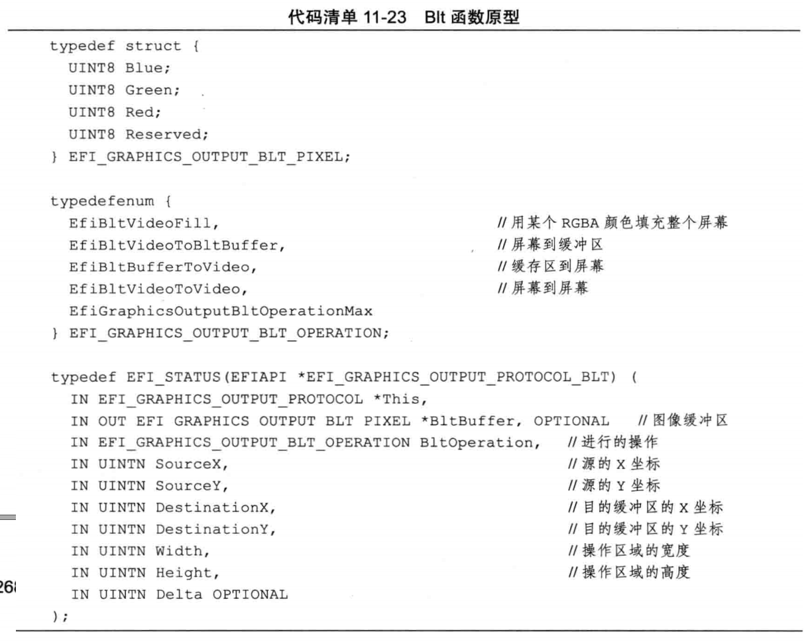
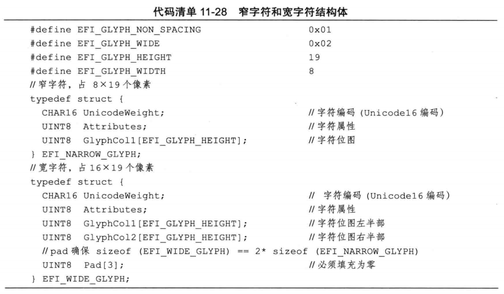

## 字符串

UEFI中默认的字符串编码为Unicode16，每个Unicode16字符占用两个字节，例如L"Hello World"；还有ASCII字符串，例如"Hello World"。

#### 字符串函数

所有操作ASCII字符串的函数都以"Ascii"为前缀，没有"Ascii"前缀的字符串函数都是Unicode16字符串函数。

* StrLen
* StrSize
* StrCpy
* StrnCpy
* StrCmp
* StrnCmp
* StrCat
* StrnCat
* StrStr: 查找子字符串
* StrDecimalToUintn: 无符号十进制字符串转十进制
* StrDecimalToUint64
* StrHexToUintn
* StrHexToUintn64
* UnicodeStrToAsciiStr: Unicode16字符串转ASCII字符串，复制每个字符的后8位到作为ASCII字符串

#### 字符串资源

字符串常量通常不会改变，且在不同语言下由不同的翻译，这些字符串可以组成资源文件。

字符串资源文件格式为.uni，EDK2会自动将.uni资源文件编译为头文件和C源代码。

HII是Human Interface Infrastructure的缩写，主要用于管理人机交互时使用的资源，包括字体、字符串、图像和窗体(Form)等。

##### 在程序中使用字符串资源

* 将要生成的HII包列表生成一个GUID
* 使用HiiAddPackages注册字符串资源
* 通过宏STRING_TOKEN获取defined字符串的标识符
  
#### 管理字符串资源

##### 通过EFI_HII_STRING_PROTOCOL管理字符串

```c
// EFI_HII_STRING_PROTOCOL结构体：

typedef struct _EFI_HII_STRING_PROTOCOL EFI_HII_STRING_PROTOCOL;
struct _EFI_HII_STRING_PROTOCOL {
    EFI_HII_NEW_STRING NewString;       // 添加字符串
    EFI_HII_GET_STRING GetString;       // 检索字符串
    EFI_HII_SET_STRING SetString;       // 更新字符串
    EFI_HII_GET_LANGUATE GetLanguages;  // 返回指定资源包支持的语言
    EFI_HII_GET_2ND_LANGUAGES GetSecondaryLanguages;    // 返回指定包列表的次要语言
};
```

##### 通过HiiLib使用字符串Protocol的服务

HiiLib是EDK2提供的HII操作库，主要对Hii Protocol(字符串Protocol、字体Protocol)等封装，还包括一些辅助函数。HiiLib中字符串相关的函数包括HiiGetString、HiiSetString和HiiGetSupportedLanguage，分别对应EFI_HII_STRING_PROTOCOL的GetString、SetString和GetLanguages。

## 管理语言

#### 读取更改系统语言

UEFI系统的当前语言存放在UEFI全局变量`L"PlatformLang"`中，更改全局变量`L"PlatformLang"`即可修改系统的语言。
全局变量`L"PlatformLangCodes"`存放了系统所支持的全部语言。

通过运行时服务提供的GetVariable和SetVariable服务可以读取和修改全局变量。变量`L"PlatformLang"`在`gEfiGlobalVariableGuid`标识的名字空间中。

#### 操作语言的辅助函数

* HIIGetSupportedLanguages
* GetNextLanguage
* GetBestLanguage

## 包列表

UEFI将资源组织在包(HII包)中，几个不同的包组织在一起构成包列表(Package List)。包列表由GUID、包列表大小和一系列包组成。每个包列表以EFI_HII_PACKAGE_END类型的包结束。



下图为包列表示例


不同的包类型包括：


## 图形界面显示

图形模式中需要使用**EFI_GRAPHICS_OUTPUT_PROTOCOL**(简称GraphicsOut)将图像显示在屏幕上，主要包含3个成员函数和1个成员变量：
```c
struct _EFI_GRAPHICS_OUTPUT_PROTOCOL {
    EFI_GRAPHICS_OUTPUT_PROTOCOL_QUERY_MODE QueryMode;          // 查询显示模式
    EFI_GRAPHICS_OUTPUT_PROTOCOL_SET_MODE SetMode;              // 设置显示模式，如设置为文本显示模式
    EFI_GRAPHICS_OUTPUT_PROTOCOL_BLE Blt;                       // 块传输，用于将图像输出到屏幕或从屏幕读取图像
    EFI_GRAPHICS_OUTPUT_PROTOCOL_MODE *Mode;                    // 成员变量，指向当前的显示模式
};
```

通过Boot Service的LocateProtocol可以获得GraphicsOut实例。当系统有多个显示设备时，可以通过OpenProtocol得到各个显示设备的GraphicsOut实例。


#### 显示模式

显示模式包括分辨率、颜色深度、系统帧缓冲区物理地址及大小等。显示模式结构体内容如下：

```c
typedef struct {
    UINT32 MaxMode;                         // 显示设备支持的模式数量
    UINT32 Mode;                            // 当前显示模式
    EFI_GRAPHICS_OUTPUT_MODE_INFORMATION *Info  // 当前显示模式下的模式信息
    UINTN SizeOfInfo;                       // Info数据结构的大小，由于不同版本的UEFI，其info大小不同，所以不能通过sizeof()判断Info的大小
    EFI_PHYSICAL_ADDRESS FrameBufferBase;       // 帧缓冲区物理地址
    UINTN FrameBufferSize;                      // 帧缓冲区大小
};
```

一般来说，系统初始化完成之后，系统帧缓冲区的物理地址和大小已经不会再次改变，其他属性(分辨率、像素颜色深度)可以改变，可能发生改变的信息保存在Info指向的内存区域。





* 当`PixelFormat`为PixelBitMask时，像素的格式由显示模式信息PixelInformation决定。如果PixelInformation为{0x000000FF, 0x0000FF00, 0x00FF0000, 0xFF000000}，其格式为RGBA，与`PixelFormat`=PixelRedGreenBlueReserved8BitPerColor相同。
* 当`PixelFormat`为PixelBltOnly时，帧缓冲区的线性物理地址无效，不能通过向g_GraphicsOutput->FrameBufferBase写内容而改变屏幕。只能通过g_GraphicsOutput->Blt()读写屏幕。

##### QueryMode和SetMode用于读取和设置`EFI_GRAPHICS_OUTPUT_MODE_INFORMATION *Info`


#### Block Transfer(Blt)传输图像

GraphicsOut可以操作显卡中的帧缓冲(FrameBuffer)，其主要操作是通过GraphicsOut的Blt服务实现的。

Blt服务可以执行如下4种操作：
* 将整个屏幕填充为某个单一颜色
* 将图像显示到屏幕上
* 将屏幕区域复制到图像Buffer中
* 复制屏幕区域到屏幕的另一块区域



#### 在图形界面上显示字符串

字体Protocol EFI_HII_FONT_PROTOCOL可以把字符串转化为位图，然后通过EFI_GRAPHICS_OUTPUT_PROTOCOL_BLT把字符串位图显示到屏幕上。

涉及的结构体包括：
* EFI_HII_FONT_PROTOCOL: 字符串转换为位图
* EFI_HII_STRING_TO_IMAGE: StringToImage的函数原型
* EFI_FONT_DISPLAY_INFO: 描述字体大小、类型、前景色、后景色的结构体
* EFI_IMAGE_OUTPUT: 定义目的位图的大小和位图地址。可以是内存地址，也可以是屏幕地址。

#### 开发SimpleFont字库

包含窄字符和宽字符两种格式，窄字符大小为8\*19 bits，宽字符大小为16\*19 bits。每个字符的Unicode16编码和他的字符位图一一对应。




#### 开发Font字库