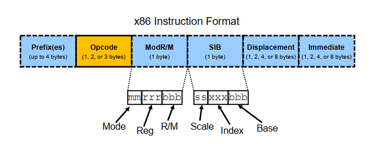

## Some Abbreviation
* ISA: Instruction Set Architecture

## x86 Lineage

* 8088(IBM to develop device)

    16-bit registers  
    16-bit instruction pointer  
    20-bit addression bus  
    8-bit data bus
  
* 8086(Intel First IA)

    16-bit registers  
    16-bit instruction pointer  
    20-bit addression bus  
    16-bit data bus

* 80286

    Protected Mode added  
    24-bit address bus  

* 80386

    32-bit registers  
    added paging

    Intel's offical name is IA-32, 32 means 32-bits registers.

* 80486

    Internal cache  
    Integrated FPU

**x86-64**(Development Name) = **AMD64**(AMD's Formal Name) = **EM64T**(Intel's Initial Name) = **Intel 64**(Intel's Current Name) = **x64**(Microsoft's Name) ***!=*** **IA64**  
IA64 is Intel's Itanium processor, not x86 related, so Intel makes the name **Intel 64**.

## Instructions

### Integer & Floating Point Instruction Groups

    general instructions: ADD, SUB, INC, DEC, MUL, DIV, XOR, ...
    x87 instructions: FADD, FMULP, FSIN, FXSAVE
    MMX instructions: PADDB, PABGW, PCMPEQB
    SSE instructions: ADDPS, SUBSD, CVTPI2PD, SQRTPS
    AVX instructions: VADDPD, VADDSUBPS, VPMASKMOV
    Program Flow instructions: JMP, JNZ, LOOP, CALL, RET, INT, IRET
    cache, TLB, hard-ware-related x86 instructions: PREFETCH, CLFLUSH, INVD, INVLPG(flush a stored page translation out of the TLB), CPUID

* MOV dest, src

        MOV AX, 7000h
        MOV AX, BX
        MOV [AX], BX
        MOV AX, [BX]

    MOV instruction supports mov register to register, memory to register, register to memory, but not **memory to memory**.

    MOVS supports move **memory to memory**.
    
* ADD dest, src

        ADD AX, BX
        ADD AX, [BX]        ; load from memory and add
        ADD [AX], BX        ; load AX from memory, add, write to AX
        ADD AX, 20

    **note**: ADD is not automic operation, use `LOCK ADD [AX], BX` to make it atomically.

* MUL src
    
        MUL BX ==> AX * BX -> DX:AX     ; DX stores upper 16 bits, AX stores lower 16 bits

* XCHG dest, src

        XCHG AX, [BX]

    It's automic, that is, it implicitly gets a `LOCK` before its instruction.

## Instruction Format

* vary in length

  * min instruction size: 1 byte

  * max instruction size: 15 bytes

  * average size:  
    32-bit code: 3.4 bytes   
    64-bit code: 3.8 bytes

